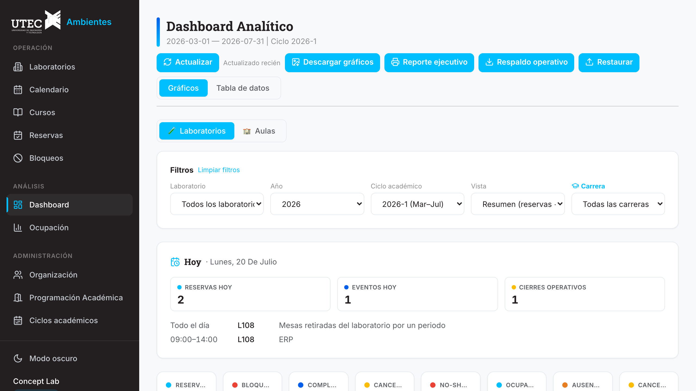
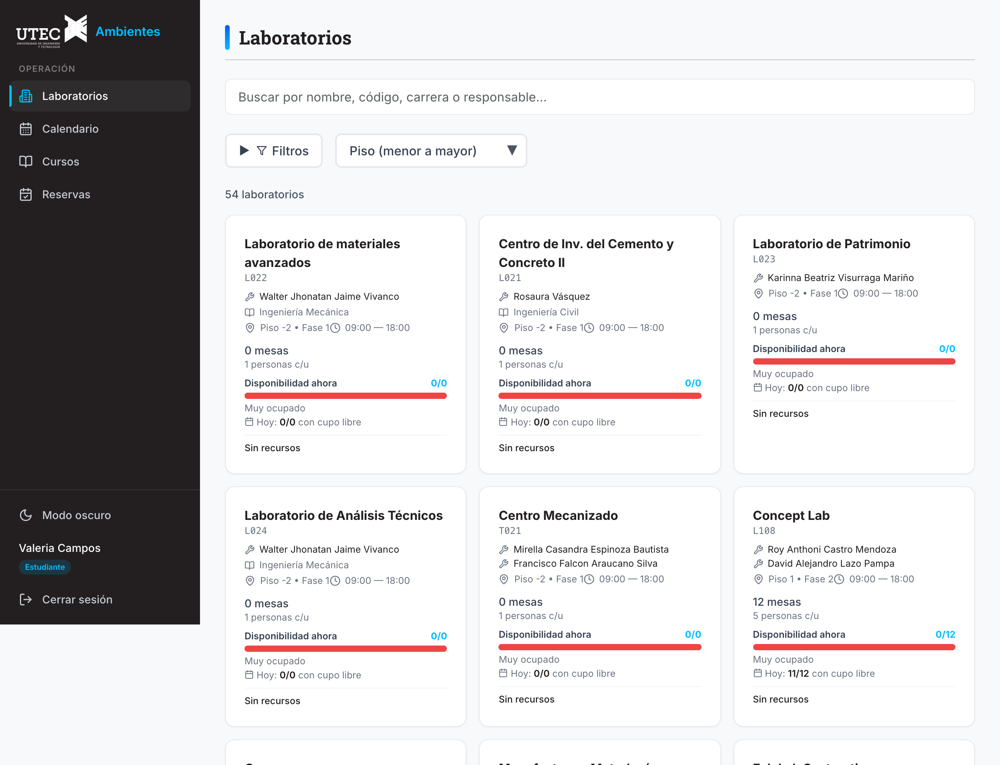
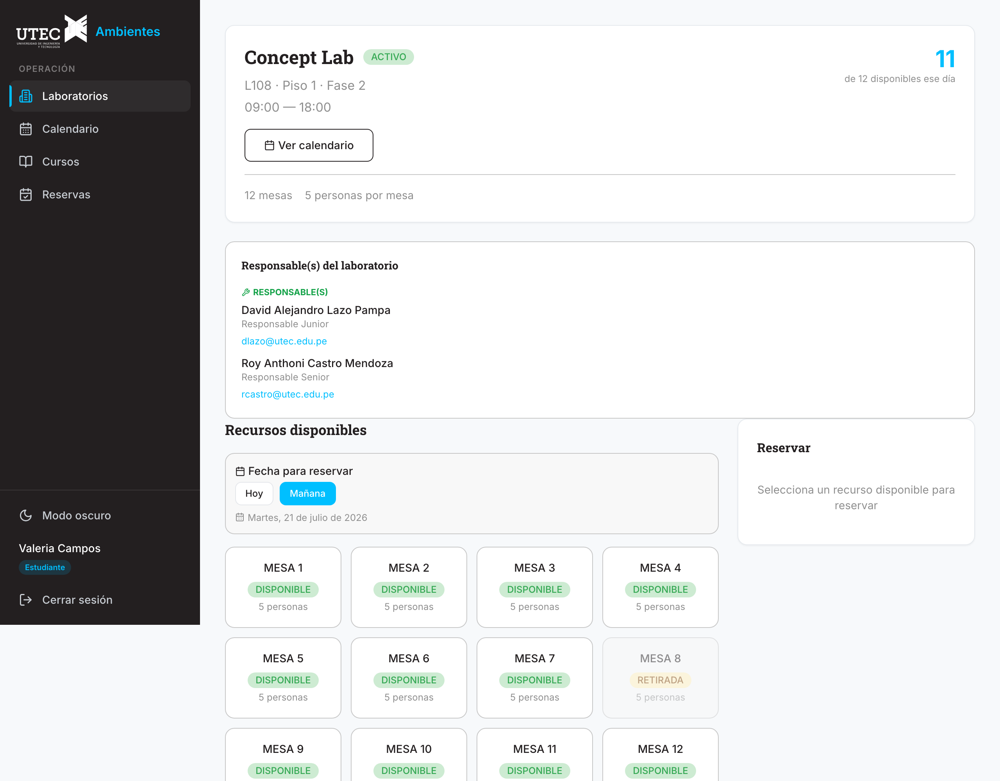
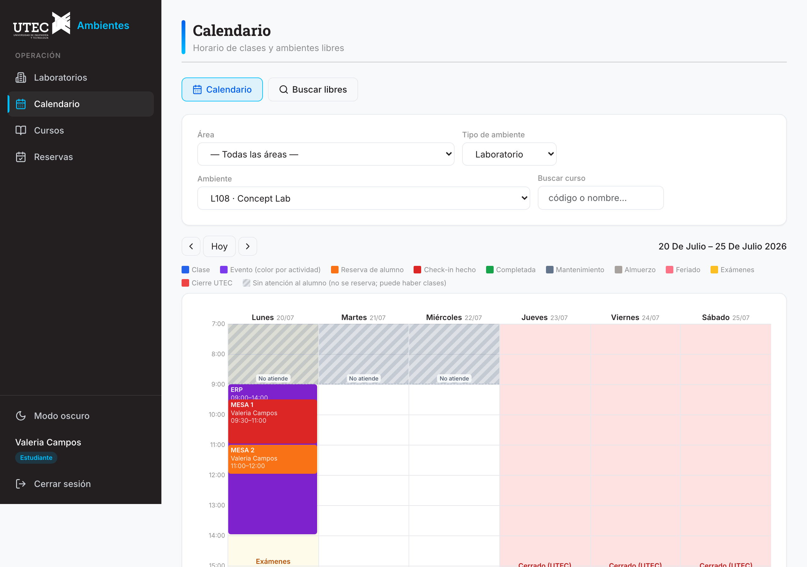
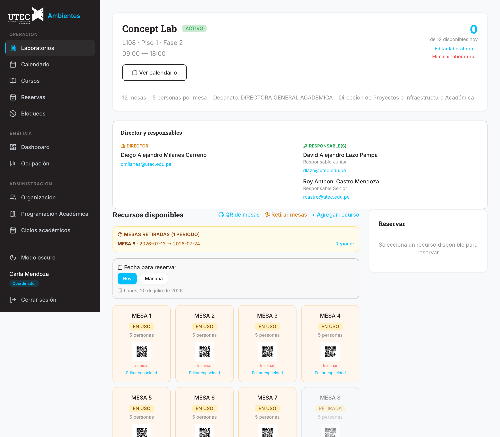
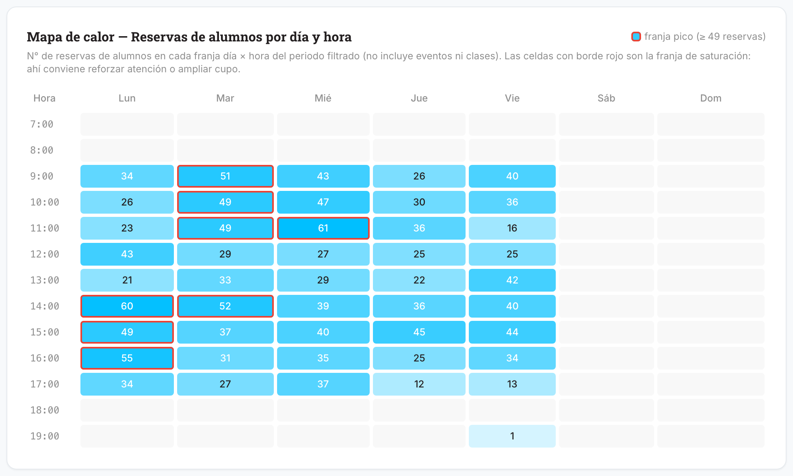
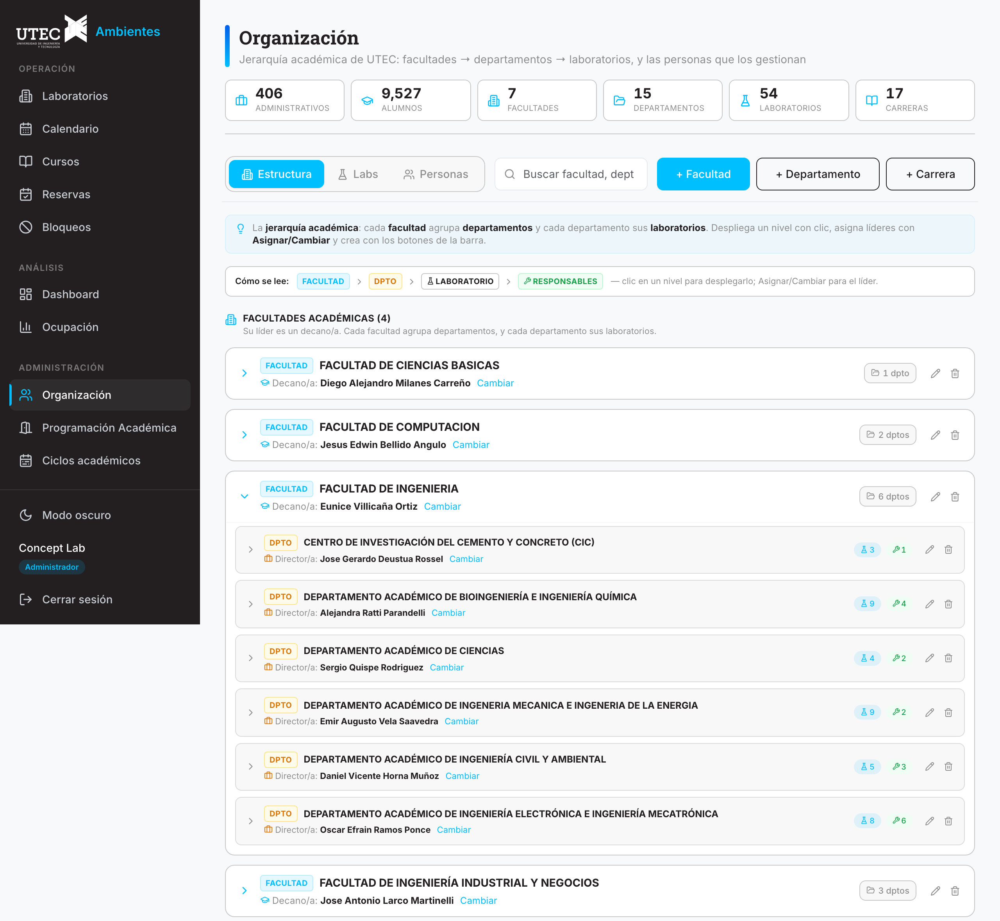

<div align="center">

# 🏛️ UTEC Ambientes

### Reserva de laboratorios y aulas · Check-in por QR · Horario académico · Analítica BI

**Plataforma full-stack que cubre el ciclo de vida completo de los ambientes académicos de la Universidad de Ingeniería y Tecnología (UTEC)** — de la reserva del estudiante hasta el dashboard ejecutivo de dirección.

<sub>Lima, Perú · monolito modular Spring Boot + SPA React</sub>

<br>


<br>


<br>



</div>

---

## ✨ Vistazo

<div align="center">
<table>
<tr>
<td width="33%" valign="top"><br><sub><b>Laboratorios</b> · búsqueda, filtros y disponibilidad en vivo</sub></td>
<td width="33%" valign="top"><br><sub><b>Reserva de mesa</b> · grilla de recursos y horarios</sub></td>
<td width="33%" valign="top"><br><sub><b>Calendario académico</b> · clases, reservas y bloqueos</sub></td>
</tr>
<tr>
<td width="33%" valign="top"><br><sub><b>QR por recurso</b> · check-in de uso presencial</sub></td>
<td width="33%" valign="top"><br><sub><b>Heatmap de ocupación</b> · franja de saturación</sub></td>
<td width="33%" valign="top"><br><sub><b>Organización</b> · jerarquía académica y personas</sub></td>
</tr>
</table>
</div>

> Recorrido ilustrado paso a paso en los manuales: **[Alumno](docs/manuales/15a-manual-alumnos.md)** · **[Administrativo](docs/manuales/15b-manual-administrativos.md)**.

---

## Tabla de contenidos

1. [Descripción](#1-descripción)
2. [Arquitectura](#2-arquitectura)
3. [Stack tecnológico](#3-stack-tecnológico)
4. [Estructura del proyecto](#4-estructura-del-proyecto)
5. [Puesta en marcha](#5-puesta-en-marcha)
6. [Seguridad y RBAC](#6-seguridad-y-rbac)
7. [Base de datos](#7-base-de-datos)
8. [API REST](#8-api-rest)
9. [Pruebas y calidad](#9-pruebas-y-calidad)
10. [Documentación](#10-documentación)
11. [Roadmap](#11-roadmap)

---

## 1. Descripción

Sistema que cubre el ciclo de vida completo de los **ambientes** académicos (laboratorios y aulas/auditorios/salas): configuración de espacios y recursos, **reserva** por parte de estudiantes, **check-in por QR**, **bloqueos** administrativos (de labs **y** aulas), **horario de clases y calendario académico**, **notificaciones** automáticas y **analítica (BI)**, todo sobre la jerarquía organizacional real de la universidad (Facultad → Departamento → Laboratorio → Responsable).

### 🎯 Lo esencial de un vistazo

- 📅 **Reservas** de mesas/PCs con control de concurrencia a nivel de BD y participantes por correo @utec.
- 📷 **Check-in por QR** (o manual) con ventana de tiempo para validar el uso presencial.
- 🧱 **Bloqueos y eventos** totales o parciales, en laboratorios y aulas, con import masivo desde Excel/CSV.
- 🗓️ **Horario académico y calendario** por ciclo (clases + reservas + bloqueos) sobre el calendario real de UTEC.
- 📊 **Dashboard BI** con KPIs, heatmap, modelo de ocupación OEE, Pareto de carreras y reporte ejecutivo a PDF.
- 🔐 **Google SSO + JWT + RBAC** de 6 roles, con autorización en triple capa (ruta · método · propiedad, anti-IDOR).
- ⚡ **Tiempo real por SSE**, correos HTML asíncronos y scheduler con lock distribuido (ShedLock).
- 🧪 **~560 tests** (backend + frontend) con *ratchet* de cobertura — ~94% backend · ~85% frontend.

### Funcionalidades principales

| Área | Funcionalidad |
|------|---------------|
| **Laboratorios** | Listado con búsqueda y filtros (piso, fase, carrera, disponibilidad **ahora**/**hoy**). En las tarjetas, los **roles de gestión** (responsable+) ven la info **completa** de director y responsables (**cargo + correo**); el **alumno** ve solo el/los **responsable(s)** del lab por nombre (sin jerarquía ni contacto). El correo clickeable (mailto) vive en el detalle del lab. |
| **Reservas** | Booking de recursos (mesas/PCs/estaciones) con control de concurrencia y hora de inicio flexible. Cada participante se registra por **correo @utec** (titular fijo + acompañantes ya registrados); su carrera alimenta la analítica. En **Gestión de Reservas** cada tarjeta lista a sus participantes (nombre · correo · carrera) y el **modal de editar pre-carga sus correos**; estos datos solo van en `/reservas/mis-reservas` (alcance dueño/gestor), no en el calendario. Reversión de cancelación (**reactivar**) el mismo día para roles de gestión. |
| **Check-in** | Validación por escaneo de QR o manual (responsable), con ventana de 10 min. |
| **UX / Seguridad de acción** | Confirmación previa (modal "¿Confirmar…?") en todo botón de eliminar/cancelar/guardar/crear/editar. |
| **Bloqueos** | Totales (todo el lab) o parciales (recursos específicos) en **laboratorios**, y bloqueos totales de **aulas/auditorios/salas** (selector "Tipo de ambiente"); ventana institucional 07:00–23:00. Import masivo desde Excel/CSV con reporte por fila. |
| **Calendario y horario académico** | Sección **Calendario** del alumno: horario de clases por ciclo (2026-0/-1/-2) sobre el calendario académico real, con exámenes/feriados; búsqueda de ambientes libres. **Programación Académica** (rol DOCENCIA): importa horarios (Excel/CSV) y gestiona aulas; **Ciclos académicos** editables. Calendario por laboratorio (semana/mes/día, reservas + bloqueos + clases, color-coded con paleta única). |
| **Organización** | CRUD de facultades/departamentos/**carreras**, asignación de decanos/directores/responsables (auto-cascada). Personas con toggle **Administrativos / Alumnos** (la carrera del alumno se asigna desde un desplegable oficial). Creación de laboratorios en **ventana flotante (modal)**, con **recursos mixtos** (mesas + PCs) y equipos especializados. |
| **Analytics / BI** | Dashboard con 4 vistas (**Todo · Solo reservas · Solo bloqueos · Uso del lab (OEE)**), KPIs, heatmap con **banda de saturación**, tendencias y reservas por carrera; export a PNG/CSV y **reporte ejecutivo one-pager a PDF** (🖨️). Refresco automático cada minuto + botón **🔄 Actualizar**. **Modelo OEE**: **% de ocupación NETA** (utilización = (reservas + eventos∩ventana) ÷ capacidad, sin feriados/mantenimiento; en *Solo reservas* solo reservas) y **Disponibilidad** (% cerrado por feriado/mantenimiento) por separado. Gráficas de analista: **embudo de estados**, **reservas por día de la semana**, **tamaño de grupo**, **Pareto** de carreras/motivos, **cruce carrera×lab**, **capacidad ociosa**, **proyección de demanda** (regresión + media móvil) (`GET /analytics/insights`). **Dashboard ejecutivo** (dirección): **Δ vs periodo anterior** + **insights narrativos** + **procedencia** de datos (`GET /analytics/resumen-ejecutivo`). Filtros de **año/ciclo derivados de la data** — solo aparecen periodos con registros (`GET /analytics/anios` · `/analytics/periodos`). |
| **Escalabilidad de usuarios** | Preparado para **miles de alumnos** (~9500+): listado **paginado** por servidor (`GET /usuarios/buscar?q&rol&activo&page&size`), lista de administrativos aparte (`/usuarios/administrativos`) y conteo por rol (`/usuarios/conteo-roles`); ninguna pantalla carga todos los alumnos de golpe. Carga masiva idempotente (`db/ops/agregar_alumnos.sh --csv`, maneja archivos grandes por STDIN). |
| **Notificaciones** | Correos HTML asíncronos (Gmail SMTP + `@Async`, **best-effort**: un fallo de SMTP no rompe la operación). Al **reservar** → "Reserva registrada — recuerda tu check-in"; al **hacer check-in** → "Check-in confirmado — estás En curso"; al **cancelar** → "Reserva cancelada"; **bloqueos** creado/editado/eliminado al responsable (operativos ALMUERZO/MANTENIMIENTO/FERIADO no notifican). El script `db/ops/reservar.sh` también envía el correo de reserva. |
| **Automatización** | Scheduler de no-show (15 min), liberación de recursos y protección de medianoche (ShedLock). |
| **Tiempo real (SSE)** | Push de cambios al instante (check-in, reservas, bloqueos) por Server-Sent Events; el polling queda como *fallback*. |
| **Seguridad** | Google OAuth2 SSO (`@utec.edu.pe`), JWT, RBAC de 6 roles (ADMIN · COORDINADOR · DIRECTOR · RESPONSABLE_LAB · ESTUDIANTE · **DOCENCIA**), auditoría de reservas. |

---

## 2. Arquitectura

**Estilo:** monolito modular (*modular monolith*) — un único despliegue de backend organizado en módulos de dominio con fronteras claras.

```text
┌──────────────────────────────────────────────────────────┐
│            Frontend · React 18 + TypeScript (Vite)         │
└──────────────────────────────────────────────────────────┘
                            │  HTTPS · JWT Bearer + cookie refresh
┌──────────────────────────────────────────────────────────┐
│        Capa de seguridad · OAuth2 Google + JWT + RBAC      │
└──────────────────────────────────────────────────────────┘
                            │
┌──────────────────────────────────────────────────────────┐
│              Backend · Spring Boot 3.5 + Java 21           │
│  ┌──────┬──────┬──────────┬──────────┬──────────────────┐ │
│  │ auth │ iam  │   labs   │ reservas │     bloqueos      │ │
│  ├──────┼──────┼──────────┼──────────┼──────────────────┤ │
│  │  qr  │aulas │ analytics │  audit  │   notificaciones  │ │
│  ├──────┼──────┼──────────┼──────────┼──────────────────┤ │
│  │      │      │ realtime │ respaldo │    schedulers     │ │
│  └──────┴──────┴──────────┴──────────┴──────────────────┘ │
└──────────────────────────────────────────────────────────┘
                            │  JPA · Flyway
┌────────────────┬───────────────────┬─────────────────────┐
│  PostgreSQL 16 │      Redis 7       │     RabbitMQ 3.13    │
└────────────────┴───────────────────┴─────────────────────┘
```

> Diagramas detallados (contexto/contenedor/componente, secuencias, ERD, flujos) en [`docs/`](docs/README.md) y [`docs/diagrams/`](docs/diagrams/README.md).

### Módulos de dominio (`pe.edu.utec.reservas.modules`)

| Módulo | Responsabilidad |
|--------|-----------------|
| `auth` | Google OAuth2 SSO, emisión y rotación de JWT (access + refresh). |
| `iam` | Usuarios, roles, permisos y asignaciones (responsables/directores). |
| `laboratorios` | CRUD de labs y recursos + estructura académica (facultades, departamentos, carreras) y organización. |
| `reservas` | Motor de reservas, validaciones y concurrencia (`SELECT FOR UPDATE` + `@Version`). |
| `bloqueos` | Bloqueos totales/parciales (`bloqueo_recursos`). |
| `qr` | Generación de QR (ZXing) y check-in (automático y manual). |
| `notificaciones` | Correos HTML asíncronos. |
| `analytics` | Dashboard, KPIs, heatmap y exportación. |
| `audit` | Auditoría de acciones sobre reservas. |
| `respaldo` | Descarga/restauración de datos (JSON). |
| `aulas` | Aulas/auditorios/salas, **cursos** y **horario de clases** (bloqueos recurrentes); import de horarios + ciclos académicos. |
| `realtime` | Push en tiempo real por **SSE** (check-in, reservas, bloqueos); el polling queda como *fallback*. |
| `schedulers` | Tareas programadas (`@Scheduled` + ShedLock). |

---

## 3. Stack tecnológico

**Backend** — Java 21 · Spring Boot 3.5.14 · Spring Security 6 · Spring Data JPA · Hibernate 6.5 · PostgreSQL 16 · Redis 7 · RabbitMQ 3.13 · Flyway 10 · Lombok · ZXing 3.5 · SpringDoc OpenAPI 2 · Maven.

**Frontend** — React 18 · TypeScript 5 · Vite · TailwindCSS 3.4 · React Router 6 · TanStack Query 5 · Zustand 5 · Recharts · `@zxing` · Axios · date-fns.

**Infraestructura** — Docker + Docker Compose (PostgreSQL, Redis, RabbitMQ, backend, frontend) · GitHub Actions (CI).

> Los **tres** contenedores de infraestructura son obligatorios: si falta alguno, `GET /actuator/health` reporta **503**.

---

## 4. Estructura del proyecto

```text
utec-lab-reservation/
├── backend/                        # Spring Boot (Java 21, Maven)
│   ├── src/main/java/pe/edu/utec/reservas/
│   │   ├── config/                 # CORS, Redis, RabbitMQ, Async, ShedLock
│   │   ├── security/               # SecurityConfig, JWT, filtros, UserDetails
│   │   ├── schedulers/             # ReservaScheduler (@Scheduled + @SchedulerLock)
│   │   ├── shared/                 # ApiResponse, GlobalExceptionHandler, BusinessException
│   │   └── modules/                # auth · iam · laboratorios · reservas · bloqueos · aulas
│   │                               # qr · notificaciones · analytics · audit · respaldo · realtime
│   ├── src/main/resources/
│   │   ├── application*.yml         # perfiles: base · local · test · prod
│   │   └── db/migration/            # Flyway: V1__baseline.sql + V2..V15 (aulas, ciclos, feriados, retiro, cierre, servicios…)
│   ├── src/test/java/              # ~300 tests (JUnit 5 + Mockito), JaCoCo
│   └── pom.xml
├── frontend/                       # React + TypeScript (Vite)
│   ├── src/
│   │   ├── pages/                  # auth · dashboard · laboratorios · reservas · checkin · admin
│   │   ├── components/             # shared (ProtectedRoute, QrImage), ui
│   │   ├── services/               # api.ts (axios), token.ts (access en memoria)
│   │   ├── store/                  # authStore (Zustand)
│   │   └── layouts/                # MainLayout
│   ├── vitest.config.ts            # ratchet de cobertura (CI)
│   └── package.json
├── docs/                           # Documentación de ingeniería (17 entregables + diagramas)
├── db/                             # Herramientas de datos (mapa en db/README.md)
│   ├── etl/                        #   ETL (Python): directorio de 54 labs, reservas Affluences/DataLabs, bloqueos
│   ├── ops/                        #   scripts operativos: reservar.sh · agregar_alumnos.sh · backup.sh · restore.sh
│   ├── data/                       #   insumos fuente: directorio-laboratorios.csv · horarios/*.xlsx
│   ├── generated/                  #   artefactos SQL que generan los ETL (gitignored)
│   └── backups/                    #   dumps pg_dump con rotación + copia off-machine (gitignored)
├── docker-compose.yml
├── INSTALL.md · DEPLOY.md · INICIAR-DEMO.md
└── README.md
```

---

## 5. Puesta en marcha

> Guía completa multiplataforma en **[INSTALL.md](INSTALL.md)**.

**Atajo (todo en segundo plano):** una vez configurado (`.env`, `application-local.yml`, Docker creado), un solo comando levanta infra + backend + frontend:

```bash
./demo.sh start          # arranca todo en background (logs en logs/)
./demo.sh start --cf     # ...y expone la web por Cloudflare (build de prod, sin límite de banda)
./demo.sh start --tunnel # ...y expone la web por el dominio fijo de ngrok (free: límite mensual)
./demo.sh status         # ver estado de cada componente (incluye los túneles)
./demo.sh logs backend   # seguir logs (backend | frontend | ngrok | cf)
./demo.sh stop           # detener backend + frontend + túneles (los contenedores quedan vivos)
```

Resumen manual para desarrollo local:

```bash
# 1) Infraestructura (PostgreSQL + Redis + RabbitMQ)
docker start utec-postgres utec-redis utec-rabbitmq    # primera vez: ver INSTALL.md

# 2) Backend (http://localhost:8080 · Swagger en /swagger-ui.html)
cd backend && ./mvnw spring-boot:run -Dspring-boot.run.profiles=local

# 3) Frontend (http://localhost:5173)
cd frontend && npm install && npm run dev
```

- Requiere copiar las plantillas de configuración (`.env.example`, `application-local.yml.example`) y un **Google Client ID** (ver INSTALL.md).
- Para exponer una **demo pública** (+ QR): `./demo.sh start --cf` (Cloudflare, sin límite de banda; URL nueva cada vez → re-autorizar en Google) o `./demo.sh start --tunnel` (ngrok, dominio fijo; el plan free limita la banda). Detalles en **[DEPLOY.md](DEPLOY.md)** e **[INICIAR-DEMO.md](INICIAR-DEMO.md)**. Hay un **banner A4 imprimible** con el QR de acceso en `docs/assets/banner-reserva-a4.svg`.

---

## 6. Seguridad y RBAC

### Flujo de autenticación

```text
Usuario ──▶ Google OAuth2 ──▶ verificación de dominio @utec.edu.pe
Backend  ──▶ access token (15 min, en body) + refresh token (7 días, cookie HttpOnly)
Frontend ──▶ access token EN MEMORIA (nunca localStorage) ──▶ Axios (Bearer)
Recarga (F5) / 401 ──▶ POST /auth/refresh (cookie) ──▶ nuevo access token
Logout ──▶ POST /auth/logout (borra la cookie)
```

> **Almacenamiento de tokens:** el refresh token va en cookie `HttpOnly` + `Secure` + `SameSite=Strict` (mitiga XSS); el access token vive solo en memoria del frontend. Las autoridades se reconstruyen desde la BD en cada request (`CustomUserDetailsService`).
>
> **`JWT_SECRET` obligatorio** (≥32 caracteres) fuera del perfil `local`; sin él la app no arranca (`JwtTokenProvider`). Generar con `openssl rand -base64 48`.

### Roles (jerarquía)

| Rol | `rol_id` | Alcance |
|-----|:--------:|---------|
| `ADMIN` | 2 | Gestión total + organización + respaldo + auditoría (remitente de correos). |
| `COORDINADOR` | 3 | Labs/recursos/reservas/bloqueos, usuarios y dashboard. |
| `DIRECTOR` | 4 | Labs de su área y dashboard. |
| `RESPONSABLE_LAB` | 5 | Solo sus labs asignados (recursos, bloqueos, check-in manual). |
| `ESTUDIANTE` | 6 | Reservar, check-in propio, ver labs activos (rol por defecto al auto-registrarse). |
| `DOCENCIA` | 7 | **Programación Académica**: importa horarios (Excel/CSV), CRUD de aulas y ciclos académicos. |

> Autorización en **doble capa**: reglas de ruta en `SecurityConfig` (se evalúan primero) + `@PreAuthorize` a nivel de método + pertenencia/propiedad a nivel de servicio (anti-IDOR). Matriz completa en [docs/12](docs/12-matriz-roles-permisos.md).

---

## 7. Base de datos

PostgreSQL 16 con **ENUMs nativos** (mapeados como `String`; la URL JDBC usa `?stringtype=unspecified`). Esquema versionado con **Flyway** (`ddl-auto: none`).

### Migraciones

El **baseline** `V1__baseline.sql` (consolidado, unifica las antiguas V1–V6) + migraciones incrementales del **módulo académico** y de datos: **`V2`** (backfill de `usuarios.departamento_id`), **`V3`** (`facultades.tipo` = FACULTAD|DIRECCION), **`V4`** (módulo **Aulas**: rol `DOCENCIA`, tablas `aulas`/`cursos` y extensión de `bloqueos` para **clases recurrentes**), **`V5`** (`ciclos_academicos`: fechas del calendario académico editables), **`V6`** (`bloqueos.frecuencia` = SEMANA_GENERAL/A/B para clases quincenales), **`V7`** (`ciclo_excepciones`: días sin clases — exámenes/feriados), **`V8`** (semana de rezagados 2026-1), **`V9`** (deriva las excepciones FERIADO desde los feriados operativos — fuente única), **`V10`** (corrige rezagados 2026-1 → 16–20 jul), **`V11`** (rol **DOCENTE** solo-consulta + backfill desde el horario), **`V12`** (motivo **RETIRO**: mesas retiradas del lab por un periodo — reducción de capacidad, no compite con eventos), **`V13`** (excepción tipo **CIERRE**: cierre institucional de todo UTEC por rango — sin clases, sin reservas, fuera de la capacidad), **`V14`** (**`laboratorio_servicios`**: servicios del lab con enlace externo, p. ej. FabLab → Impresiones 3D) y **`V15`** (completa `carreras.departamento_id` faltantes por nombre exacto). El baseline **re-consolidado** ya absorbió las antiguas V1–V21 (reservas Affluences/DataLabs, feriados 2024–2026, limpiezas de esquema); su detalle vive en el historial de git. Tras estas migraciones el esquema vivo tiene **25 tablas · 8 ENUMs** (el baseline traía 22 tablas · 12 ENUMs). El baseline contiene:

| Incluye (origen) | Contenido |
|------------------|-----------|
| Esquema + datos | 22 tablas, 12 ENUMs, índices y constraints + semilla (roles, permisos, usuarios base, **directorio de 54 labs**) + import de **616 reservas Affluences L108**. |
| ex-V2 | Sin el `CHECK fecha >= CURRENT_DATE` (la validación de fecha vive en `ReservaService`). |
| ex-V3 / ex-V5 | ENUMs con `ALMUERZO` (`motivo_bloqueo`) y `EQUIPO` (`tipo_aforo`). |
| ex-V4 | Tabla `shedlock` (lock distribuido para varias instancias). |
| ex-V6 | **Anti doble-reserva** (`EXCLUDE` con `btree_gist` sobre reservas activas) + **índices** de rendimiento (`reservas`, `recursos_lab`, `bloqueos`). |

> El detalle paso a paso queda en el historial de git. El baseline aplicado es **inmutable** (Flyway valida checksums); todo cambio futuro va en una migración nueva (`V2__…`).

### Modelo relacional (resumen)

```text
facultades ─┬─▶ departamentos ─▶ laboratorios ─▶ recursos_lab ─▶ reservas ─┬─▶ qr_validaciones
            └─▶ carreras ──────────┘                  ▲                     └─▶ auditoria_reservas
usuarios ─▶ roles ─(N:M)─ permisos        laboratorios ─▶ bloqueos ─▶ bloqueo_recursos
usuarios ─(N:M)─ laboratorios (lab_responsables)         (decano/director/responsable)
```

> ERD completo e interactivo: [docs/09](docs/09-erd-base-datos.md) · [docs/diagrams/er-diagram.html](docs/diagrams/er-diagram.html).

### Concurrencia y validación de reservas

- **Lock pesimista** (`SELECT ... FOR UPDATE`) + **lock optimista** (`@Version`) en el servicio, y como **red de seguridad a nivel de BD** un **constraint de exclusión** (`btree_gist`) que impide físicamente dos reservas activas solapadas sobre la misma mesa (a prueba de concurrencia, incluso con varias instancias).
- Validaciones: usuario/recurso/lab activos, fecha y anticipación (default 1 día), día de atención, horario del lab, aforo, bloqueos totales/parciales y solapamientos.
- **Dos ventanas horarias:** reservas de alumno → horario del lab; bloqueos → ventana institucional **07:00–23:00**.

---

## 8. API REST

**Base URL:** `/api/v1` · **Auth:** JWT Bearer (salvo endpoints públicos) · **Docs vivas:** `/swagger-ui.html`.

| Método | Endpoint | Roles |
|--------|----------|-------|
| `POST` | `/auth/google` · `/auth/refresh` · `/auth/logout` | Público |
| `GET` | `/laboratorios` · `/laboratorios/{id}` · `/laboratorios/{id}/recursos` | Autenticado |
| `POST`/`PUT` | `/laboratorios` · `/laboratorios/{id}` | Admin, Coord (+ Resp. en sus labs) |
| `POST` | `/reservas` · `PUT`/`DELETE /reservas/{id}` | Autenticado (dueño o rol elevado) |
| `POST` | `/checkin/qr/{qrCode}` · `/checkin/manual/{reservaId}` | Autenticado / Resp.+ |
| `POST` | `/bloqueos` · `PATCH`/`DELETE /bloqueos/{id}` | Admin, Coord, Director, Resp. |
| `GET` | `/analytics/dashboard` · `/dashboard/full` · `/tabla` · `/operativos` · `/insights` | Director+ |
| `GET`/`POST` | `/usuarios` · `/organizacion/**` | Admin (algunos Coord) |
| `GET`/`POST` | `/respaldo` | Admin |

> Referencia completa endpoint por endpoint en [docs/13](docs/13-documentacion-api.md). Respuesta estándar: `{ "success", "message", "data" }`.

---

## 9. Pruebas y calidad

| Capa | Suite | Cobertura | Gate (ratchet) |
|------|-------|-----------|----------------|
| **Backend** | ~300 tests (JUnit 5 + Mockito) · JaCoCo | ~94% instrucción · ~72% rama | `jacoco:check` en `mvn verify` (INSTRUCTION ≥0.90, BRANCH ≥0.65) |
| **Frontend** | ~258 tests · Vitest (v8/AST) | 85% líneas · 81% stmts · 72% ramas · 74% funcs | `vitest.config.ts` (lines 85 · stmts 81 · branches 71 · funcs 74) |

```bash
# Backend (requiere BD utec_labs_test) — corre tests + cobertura + gate
cd backend && ./mvnw verify

# Frontend
cd frontend && npm run test:coverage
```

Ambas suites comparten un **ratchet de cobertura** que falla si la cobertura cae por debajo del umbral fijado. Los tests backend fijan la zona horaria en `America/Lima` para ser deterministas.

---

## 10. Documentación

La documentación de ingeniería vive en **[`docs/`](docs/README.md)** (17 entregables + diagramas, generados a partir del código real):

| | Documento | | Documento |
|---|---|---|---|
| 01 | [Requerimientos funcionales](docs/01-requerimientos-funcionales.md) | 10 | [Arquitectura C4](docs/10-arquitectura-c4.md) |
| 02 | [Requerimientos no funcionales](docs/02-requerimientos-no-funcionales.md) | 11 | [Wireframes](docs/11-wireframes.md) |
| 03 | [Historias de usuario](docs/03-historias-de-usuario.md) | 12 | [Matriz de roles y permisos](docs/12-matriz-roles-permisos.md) |
| 04 | [Casos de uso](docs/04-casos-de-uso.md) | 13 | [Documentación API](docs/13-documentacion-api.md) |
| 05 | [Diagrama de casos de uso](docs/05-diagrama-casos-de-uso.md) | 14 | [Casos de prueba](docs/14-casos-de-prueba.md) |
| 06 | [Diagramas de actividades](docs/06-diagrama-actividades.md) | 15 | [Manual del Alumno](docs/manuales/15a-manual-alumnos.md) · [Administrativo](docs/manuales/15b-manual-administrativos.md) (ilustrados, [PDF](docs/manuales/15a-manual-alumnos.pdf)/[PDF](docs/manuales/15b-manual-administrativos.pdf)) |
| 07 | [Diagramas de secuencia](docs/07-diagrama-secuencia.md) | 16 | [Manual técnico](docs/16-manual-tecnico.md) |
| 08 | [Diagrama de clases](docs/08-diagrama-clases.md) | 17 | [Guía visual de flujos](docs/17-guia-visual-flujos.md) |
| 09 | [ERD](docs/09-erd-base-datos.md) | 🎨 | [Diagramas visuales (SVG/HTML)](docs/diagrams/README.md) |

---

## 11. Roadmap

**Completado**

- [x] Auth (Google OAuth2 + JWT access/refresh en cookie), IAM y RBAC (6 roles).
- [x] Laboratorios + recursos, reservas con concurrencia, QR + check-in, bloqueos totales/parciales.
- [x] Notificaciones (correos HTML `@Async`), analytics/BI (dashboard, heatmap, carrera, CSV/PNG).
- [x] Organización (CRUD + alta manual de personas), calendario por lab, auditoría, respaldo/restauración.
- [x] Import de datos reales (directorio de 54 labs + 616 reservas Affluences L108).
- [x] CI/CD (GitHub Actions), endurecimiento de seguridad (auditoría cyber-neo remediada), ShedLock.
- [x] Tests: backend ~300 (~94%) y frontend ~258 (~85%), con ratchet enforced en CI.
- [x] Documentación de ingeniería (17 entregables) + diagramas visuales + guía de flujos.

**Pendiente**

- [ ] Integración con Google Calendar (sincronización de eventos externos).
- [ ] Docker Compose de producción y despliegue.

---

<div align="center">

**Proyecto interno UTEC** · Desarrollo full-stack: David Alejandro Lazo Pampa
Contacto: `dlazo@utec.edu.pe`

</div>
