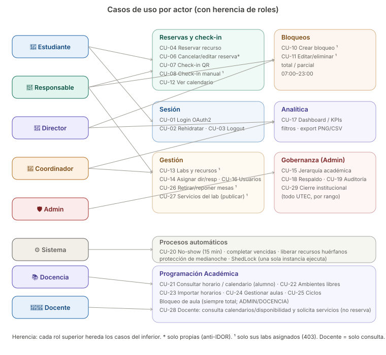
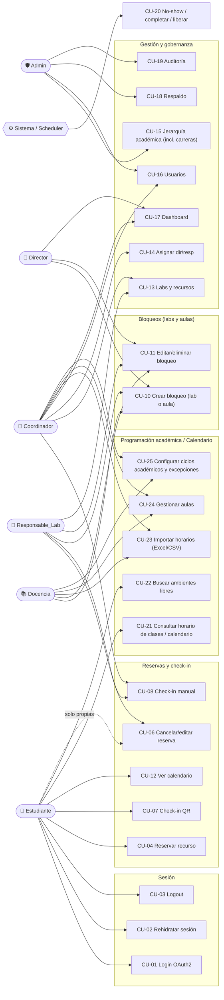
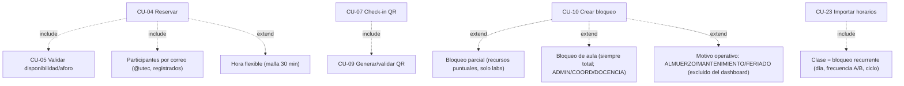

# 5. Diagrama de Casos de Uso

> **Versión visual:** [diagrams/use-cases.svg](diagrams/use-cases.svg)
>
> 

> Vista global actor ↔ caso de uso. Detalle de cada CU en [04-casos-de-uso.md](04-casos-de-uso.md).
> Mermaid no tiene un tipo nativo "use case", así que se modela con un grafo (actores → casos de uso).
> Por **herencia de roles**: cada rol superior puede todo lo del inferior (un COORDINADOR también reserva, etc.).

## Vista por actor

> **Docencia (📚):** rol nuevo que gestiona la **programación académica** (importar horarios, aulas, ciclos) y puede **bloquear aulas** (no labs). El **alumno** consulta el horario/calendario y busca ambientes libres (CU-21/22).

## Notas de autorización
- **Herencia:** las flechas muestran *lo nuevo* que aporta cada rol; los superiores heredan lo de los inferiores.
- **Pertenencia (¹):** `RESPONSABLE_LAB` solo opera CU-08/10/11/13 sobre **sus** labs (`asegurarAccesoAlLab` → 403).
- **Propiedad (anti-IDOR):** CU-06 lo limita el `ReservaService` al dueño o rol elevado.
- **Solo ADMIN:** CU-15 (jerarquía), CU-18 (respaldo), CU-19 (auditoría) y los vínculos director↔responsable.
- **Actor sistema:** CU-20 lo ejecuta el `ReservaScheduler` (sin intervención humana), con ShedLock.

## Relaciones «include» / «extend»

