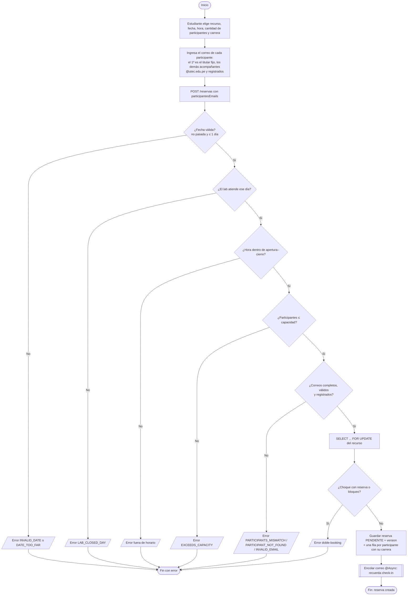
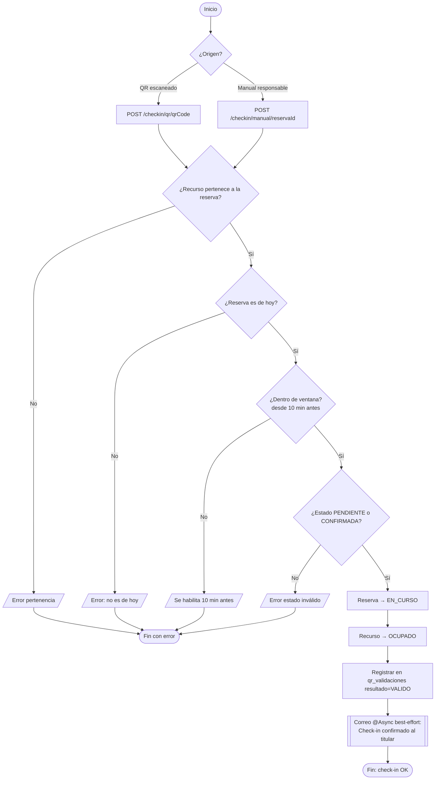
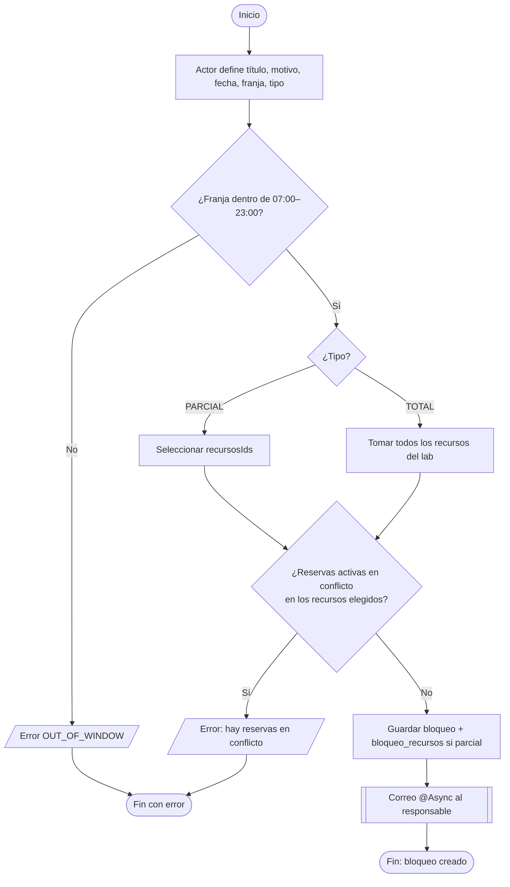
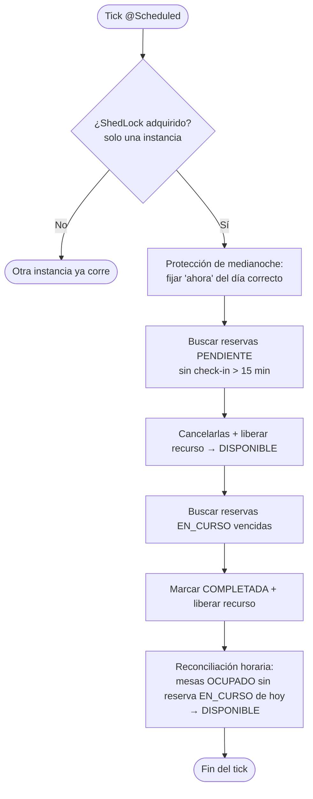

# 6. Diagramas de Actividades

> Flujos de proceso (Mermaid `flowchart`). Basados en `ReservaService`, `QrCheckinService`, `BloqueoService` y `ReservaScheduler`.

## 6.1 Crear reserva

> La carrera de cada participante (titular = la elegida; acompañantes = la de su perfil) se guarda en `reserva_participantes` y alimenta la gráfica "Reservas por carrera" del dashboard (cuenta por persona).

## 6.2 Check-in (QR y manual)

## 6.3 Crear bloqueo (total / parcial)

## 6.4 Scheduler (no-show / completar / liberar)

> La **reconciliación** (`liberarRecursosCompletados`, cada hora) es una red de seguridad: si una mesa quedó pegada en `OCUPADO` por un check-in cuya reserva ya terminó, la devuelve a `DISPONIBLE`. Los bloqueos no tocan `recurso.estado`, así que es seguro.
