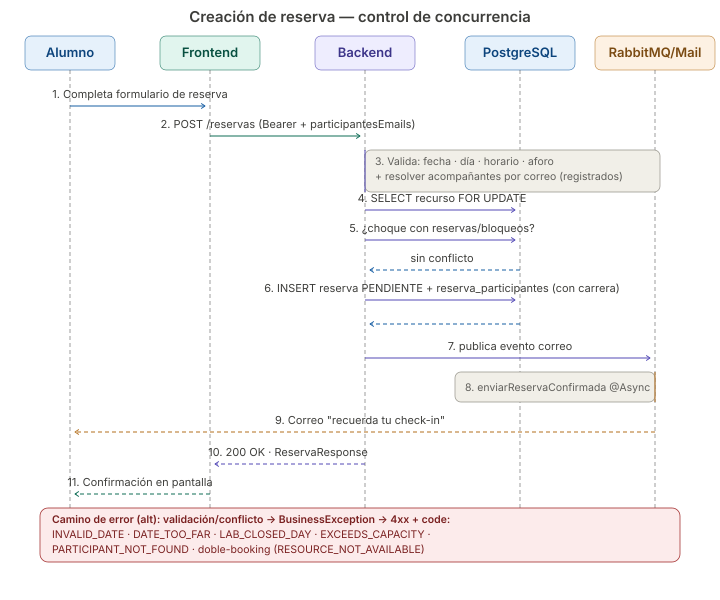
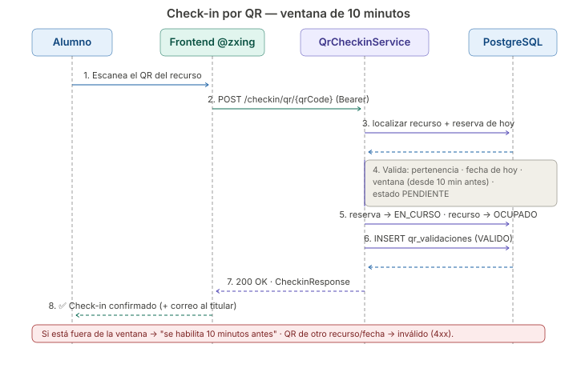
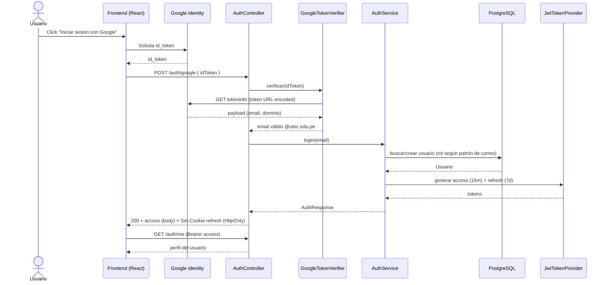
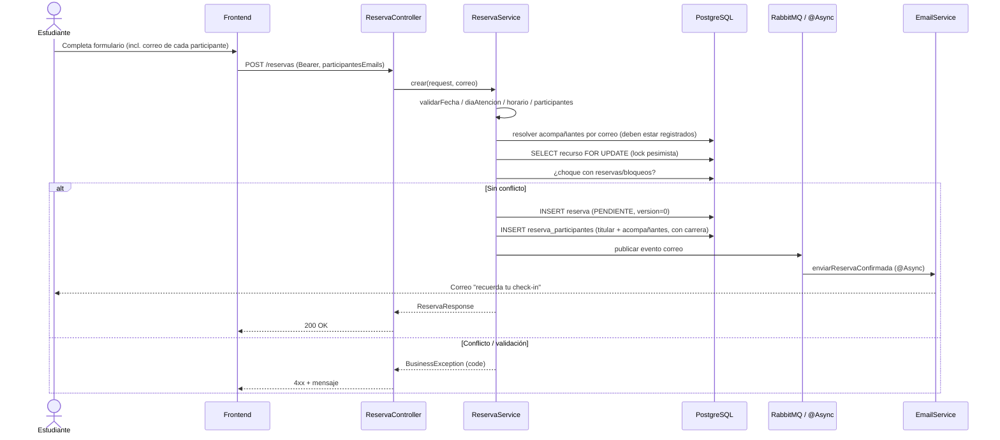
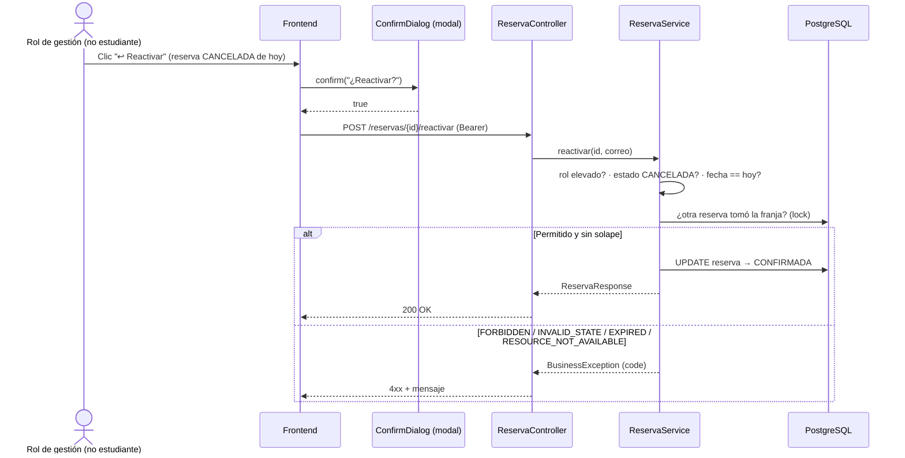
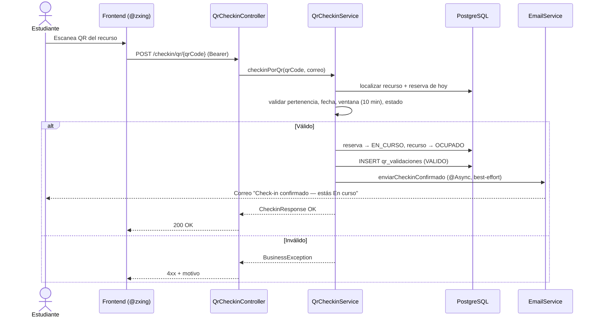
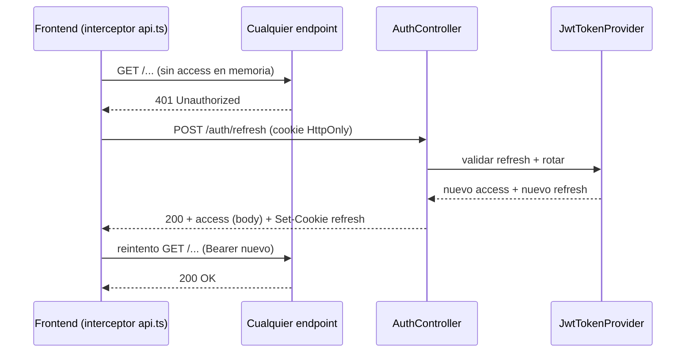

# 7. Diagramas de Secuencia

> **Versiones visuales:** [reserva](diagrams/reservation-flow-sequence.svg) · [check-in](diagrams/checkin-flow-sequence.svg)
>
> 
>
> 

> Interacción entre componentes reales (Mermaid `sequenceDiagram`).

## 7.1 Login con Google OAuth2 + JWT

## 7.2 Crear reserva

## 7.2b Revertir cancelación (reactivar reserva)

## 7.3 Check-in por QR

> El mismo correo se envía en el **check-in manual** del responsable (`POST /checkin/manual/{reservaId}`) y en el auto-scan; va al **titular** de la reserva.

## 7.4 Refresh de token (rehidratar sesión)

