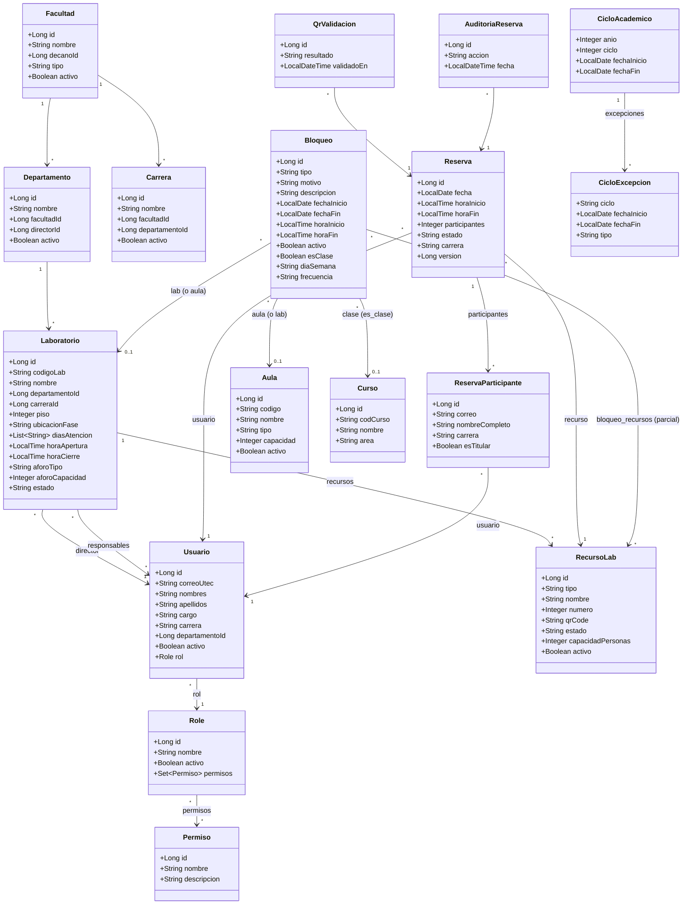
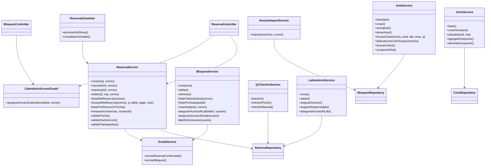

# 8. Diagrama de Clases

> Entidades del dominio y servicios principales (Mermaid `classDiagram`). Campos derivados de las entidades JPA reales en `modules/**/model`.

## 8.1 Modelo de dominio (entidades)

> **Espacio del bloqueo:** un `Bloqueo` recae en un **laboratorio** *o* en un **aula** (constraint `chk_bloqueo_espacio` = exactamente uno). Una **clase** del horario académico es un `Bloqueo` recurrente (`esClase=true`, `diaSemana`, `frecuencia` SEMANA_A/B/GENERAL, opcionalmente ligado a un `Curso`).

## 8.2 Capa de servicios (arquitectura por capas)

> **Módulo de aulas/horario:** `AulaService` consulta clases y ocupación (las clases son bloqueos `es_clase=true`); `HorarioImportService` carga el Excel de horarios; `CicloService` gestiona el calendario académico (`ciclos_academicos` + excepciones). El bloqueo de **aulas** se crea con `BloqueoService.crearAula` (siempre TOTAL, solo ADMIN/COORDINADOR/DOCENCIA).

> **Patrón:** controller → service → repository; DTOs para entrada/salida (no se exponen entidades). La regla de **auto-cascada** responsable→director→departamento vive en `LaboratorioService`. La validación de **propiedad** (anti-IDOR) vive en `ReservaService.cancelar/editar`; `reactivar` revierte una cancelación solo para roles de gestión y solo el mismo día.
>
> **Escalabilidad (jul-2026):** `ReservaService.buscarMisReservas` es la versión **paginada** de Gestión de Reservas (page/size/q en el servidor; enriquece participantes/`esMia` solo de la página vía `enriquecer()`, compartido con `listarMisReservas`). `CalendarioAccessGuard.asegurarAccesoCalendario` acota los endpoints de calendario (`/reservas|/bloqueos/laboratorio/{id}`) por rol → 403 en labs ajenos para director/responsable.
>
> **Datos denormalizados (snapshot):** `reserva_participantes.nombre_completo`/`.carrera` y `reservas.carrera` son **copias congeladas** tomadas al reservar, no un join vivo a `Usuario`. Por eso `UsuarioService.actualizar`, cuando cambia `nombres`/`apellidos`/`carrera`, **propaga** el valor actual del perfil a todas esas filas (UPDATE nativo) para que la corrección se vea en Gestión de Reservas. El listado de gestión (`/reservas/mis-reservas`) adjunta `ReservaResponse.participantesLista` (DTO `ParticipanteResumen`) en una query batch; los endpoints de calendario la dejan `null` (no exponen la composición de la reserva).
