# 9. Diagrama ERD (Base de Datos)

> **Versión visual interactiva:** [diagrams/er-diagram.html](diagrams/er-diagram.html) (ábrela en el navegador; renderiza este mismo ERD con tema).

> Modelo relacional (PostgreSQL 16, gestionado con Flyway). Mermaid `erDiagram`.
> ENUMs **nativos** de Postgres mapeados como `String` en JPA (URL JDBC con `?stringtype=unspecified`).

## 9.1 Entidad-Relación (tablas de dominio)

```mermaid
erDiagram
    FACULTADES ||--o{ DEPARTAMENTOS : tiene
    FACULTADES ||--o{ CARRERAS : ofrece
    FACULTADES }o--|| USUARIOS : decano
    DEPARTAMENTOS ||--o{ LABORATORIOS : agrupa
    DEPARTAMENTOS }o--|| USUARIOS : director
    LABORATORIOS ||--o{ LAB_RECURSOS : contiene
    LABORATORIOS }o--|| USUARIOS : director
    LABORATORIOS ||--o{ LAB_RESPONSABLES : asigna
    USUARIOS ||--o{ LAB_RESPONSABLES : es_responsable
    USUARIOS ||--o{ DIRECTOR_RESPONSABLES : vinculo
    USUARIOS }o--|| ROLES : tiene
    ROLES ||--o{ ROLES_PERMISOS : mapea
    PERMISOS ||--o{ ROLES_PERMISOS : mapea
    LAB_RECURSOS ||--o{ RESERVAS : se_reserva
    USUARIOS ||--o{ RESERVAS : crea
    RESERVAS ||--o{ RESERVA_PARTICIPANTES : participan
    USUARIOS ||--o{ RESERVA_PARTICIPANTES : participa
    RESERVAS ||--o{ QR_VALIDACIONES : valida
    RESERVAS ||--o{ AUDITORIA_RESERVAS : registra
    LABORATORIOS ||--o{ BLOQUEOS : cierra
    AULAS ||--o{ BLOQUEOS : cierra
    CURSOS ||--o{ BLOQUEOS : clase
    CICLOS_ACADEMICOS ||--o{ CICLO_EXCEPCIONES : excepciones
    BLOQUEOS ||--o{ BLOQUEO_RECURSOS : parcial
    LAB_RECURSOS ||--o{ BLOQUEO_RECURSOS : afecta

    USUARIOS {
        bigint id PK
        varchar correo_utec UK
        varchar nombres
        varchar apellidos
        varchar cargo
        varchar carrera
        bigint departamento_id FK
        bigint rol_id FK
        boolean activo
    }
    ROLES {
        bigint id PK
        varchar nombre UK
        boolean activo
    }
    PERMISOS {
        bigint id PK
        varchar nombre UK
    }
    FACULTADES {
        bigint id PK
        varchar nombre
        bigint decano_id FK
        varchar tipo "FACULTAD|DIRECCION"
        boolean activo
    }
    DEPARTAMENTOS {
        bigint id PK
        varchar nombre
        bigint facultad_id FK
        bigint director_id FK
        boolean activo
    }
    CARRERAS {
        bigint id PK
        varchar nombre
        bigint facultad_id FK
        bigint departamento_id FK "V12"
        boolean activo
    }
    LABORATORIOS {
        bigint id PK
        varchar codigo_lab UK
        varchar nombre
        bigint departamento_id FK
        bigint carrera_id FK
        bigint director_id FK
        int piso
        time hora_apertura
        time hora_cierre
        enum tipo_aforo
        enum estado
    }
    LAB_RECURSOS {
        bigint id PK
        bigint laboratorio_id FK
        enum tipo_aforo "MESA|PC|ESTACION|EQUIPO"
        varchar nombre
        int numero
        varchar qr_code UK
        enum estado_recurso
        int capacidad_personas
        boolean activo
    }
    RESERVAS {
        bigint id PK
        bigint recurso_id FK
        bigint usuario_id FK
        date fecha
        time hora_inicio
        time hora_fin
        int participantes
        enum estado_reserva
        varchar carrera
        bigint version
    }
    RESERVA_PARTICIPANTES {
        bigint id PK
        bigint reserva_id FK
        bigint usuario_id FK "V10"
        varchar correo_utec
        varchar nombre_completo
        varchar carrera "V10"
        boolean es_titular "V10"
    }
    BLOQUEOS {
        bigint id PK
        bigint laboratorio_id FK "lab O aula (uno)"
        bigint aula_id FK "lab O aula (uno)"
        enum tipo_bloqueo "TOTAL|PARCIAL"
        enum motivo_bloqueo
        date fecha_inicio
        date fecha_fin
        time hora_inicio
        time hora_fin
        boolean activo
        boolean es_clase "clase del horario"
        enum dia_semana "LUNES..DOMINGO"
        enum frecuencia "SEMANA_A|B|GENERAL"
        bigint curso_id FK "si es clase"
    }
    AULAS {
        bigint id PK
        varchar codigo
        varchar nombre
        enum tipo_aula "AULA|AULA_MIXTA|AUDITORIO|..."
        int capacidad
        boolean activo
    }
    CURSOS {
        bigint id PK
        varchar cod_curso
        varchar nombre
        varchar area "prefijo del código"
    }
    CICLOS_ACADEMICOS {
        bigint id PK
        int anio
        int ciclo "0|1|2"
        date fecha_inicio
        date fecha_fin
    }
    CICLO_EXCEPCIONES {
        bigint id PK
        varchar ciclo "YYYY-C"
        date fecha_inicio
        date fecha_fin
        varchar tipo "EXAMEN|FERIADO|OTRO"
        varchar descripcion
    }
    QR_VALIDACIONES {
        bigint id PK
        bigint reserva_id FK
        enum resultado_qr "VALIDO|INVALIDO|..."
        timestamp validado_en
    }
    AUDITORIA_RESERVAS {
        bigint id PK
        bigint reserva_id FK
        varchar accion
        timestamp fecha
    }
```

## 9.2 ENUMs nativos (8)
| ENUM | Valores |
|------|---------|
| `tipo_aforo` | MESA, PC, ESTACION, **EQUIPO** (añadido en V5) |
| `estado_lab` | ACTIVO, INACTIVO |
| `estado_recurso` | DISPONIBLE, OCUPADO, … |
| `estado_reserva` | PENDIENTE, CONFIRMADA, EN_CURSO, COMPLETADA, CANCELADA, NO_SHOW |
| `tipo_reserva` | ALUMNO |
| `tipo_bloqueo` | TOTAL, PARCIAL |
| `motivo_bloqueo` | MANTENIMIENTO, CLASE, EVENTO, **ALMUERZO** (V3), ASESORIA, REUNION, EXAMEN, **FERIADO** (V14) |
| `resultado_qr` | VALIDO, INVALIDO, EXPIRADO, RECURSO_NO_COINCIDE |

> **Limpieza de esquema:** del baseline original se eliminaron 4 enums muertos (`canal_notificacion`, `estado_notificacion`, `tipo_notificacion`, `estado_equipo`, junto con sus tablas `notificaciones`/`equipamiento`, en **V8**) → quedan **8**. En **V9** se quitaron valores redundantes: `estado_reserva` ya no tiene `ANULADA` (se usa `CANCELADA`) y `tipo_reserva` solo conserva `ALUMNO` (los bloqueos viven en su tabla, no como reservas).

> **Cambios de esquema recientes:** **V10** amplía `reserva_participantes` (existía vacía en el baseline) con `usuario_id`, `carrera` y `es_titular` → cada reserva registra una fila por participante (titular + acompañantes) y la gráfica de carreras cuenta por persona. **V11** **puebla** `director_responsables` (derivada de responsable→lab→director). **V12** añade `carreras.departamento_id` (cada carrera puede colgar de un departamento, no solo de la facultad). **V13** elimina `laboratorios.computadoras` (era solo informativo y redundante con las PCs como recurso reservable). **V14** añade `FERIADO` al enum `motivo_bloqueo` (cierre TOTAL del lab por día feriado; operativo, excluido del dashboard de eventos). **V15** carga los **32 feriados nacionales** de Perú 2025+2026 como bloqueos `TOTAL`/`FERIADO` (09:00–18:00) sobre los labs ACTIVOS.

> ⚠️ **Nota de versionado (jul-2026):** el **baseline se re-consolidó** en `V1__baseline.sql` (absorbe las antiguas V1–V21 descritas arriba). Las migraciones **vigentes** en `db/migration` son el baseline + **V2..V10**: `V2` backfill de `usuarios.departamento_id`; `V3` `facultades.tipo` (FACULTAD/DIRECCION); **`V4` módulo de AULAS** (rol `DOCENCIA` + tablas **`aulas`**/**`cursos`** + extensión de `bloqueos` para clases: `aula_id`, `es_clase`, `dia_semana`, `curso_id`, `seccion`, `tipo_sesion`, `modalidad`); **`V5` `ciclos_academicos`** (calendario académico por ciclo); `V6` `bloqueos.frecuencia` (SEMANA_A/B/GENERAL, clases quincenales); **`V7` `ciclo_excepciones`** (días sin clases: exámenes/feriados); `V8`/`V10` semanas de exámenes de 2026-1; **`V9` reconcilia feriados** (deriva las excepciones FERIADO del calendario desde los feriados operativos, fuente única). El **espacio del bloqueo** es un lab **o** un aula (`num_nonnulls(laboratorio_id, aula_id)=1`).

> **Migraciones vigentes (post re-baseline, jul-2026):** las antiguas V2–V21 se consolidaron en **`V1__baseline.sql`** (`pg_dump`). Sobre ese baseline hoy corren dos migraciones nuevas: **`V2__backfill_departamento_usuarios.sql`** rellena `usuarios.departamento_id` heredándolo de la estructura (director→depto que dirige, responsable→depto de su lab); **`V3__facultad_tipo.sql`** añade `facultades.tipo` (`FACULTAD` = su líder es Decano/a · `DIRECCION` = área administrativa, su líder es Director/a) y clasifica las existentes por nombre. La próxima será `V4__…`.

## 9.3 Tablas operativas (no de dominio)
- `lab_responsables` y `director_responsables` — relaciones N:M (esta última **poblada en V11** a partir de responsable→lab→director).
- `roles_permisos` — N:M rol↔permiso.
- `bloqueo_recursos` — recursos puntuales de un bloqueo PARCIAL.
- `shedlock` — lock distribuido para `@Scheduled` (V4).
- `flyway_schema_history` — control de migraciones.

> **Gotcha (consultas nativas):** con ENUMs nativos hay que castear ambos lados a `varchar` (`CAST(col AS VARCHAR) = CAST(:param AS VARCHAR)`) y envolver los `:param IS NULL` en `CAST(...)`.
