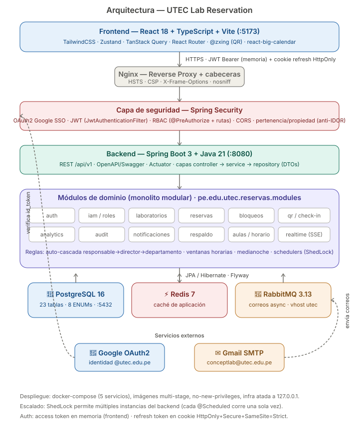
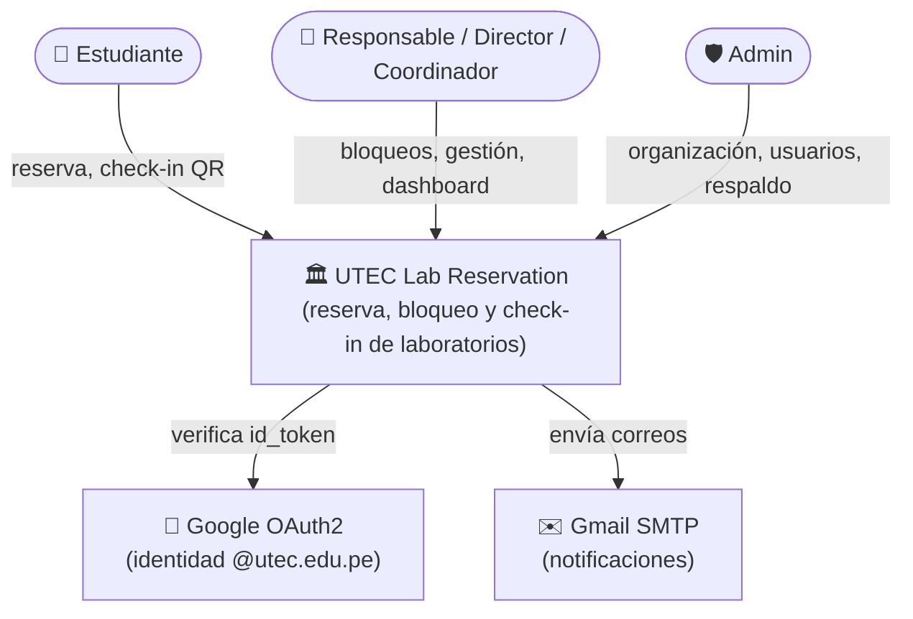
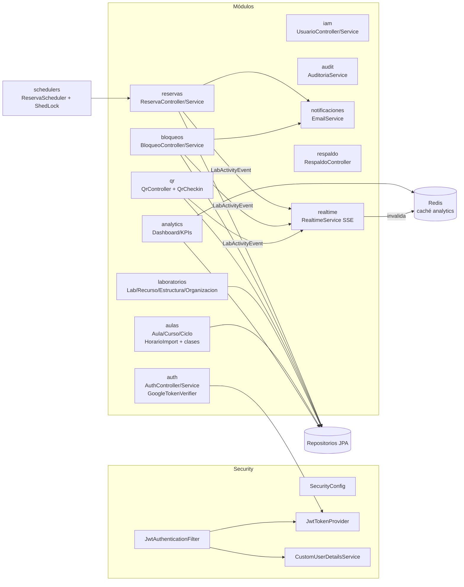

# 10. Arquitectura C4

> **Versión visual:** [diagrams/system-architecture.svg](diagrams/system-architecture.svg)
>
> 

> Modelo C4 (Contexto → Contenedor → Componente). Representado con Mermaid `flowchart`.

## C1 — Contexto del sistema


## C2 — Contenedores
```mermaid
flowchart TB
    subgraph Cliente
        FE["🖥️ Frontend SPA<br/>React 18 + Vite + Tailwind<br/>:5173"]
    end
    subgraph Servidor
        BE["⚙️ Backend API<br/>Spring Boot 3 / Java 21<br/>:8080"]
        DB[("🐘 PostgreSQL 16<br/>:5432")]
        REDIS[("⚡ Redis 7<br/>caché")]
        MQ[("🐰 RabbitMQ 3.13<br/>correos async")]
    end
    GOOGLE["Google OAuth2"]
    GMAIL["Gmail SMTP"]

    FE -->|REST /api/v1 (JWT Bearer + cookie refresh)| BE
    BE --> DB
    BE --> REDIS
    BE --> MQ
    MQ -->|@Async| GMAIL
    FE -->|id_token| GOOGLE
    BE -->|tokeninfo| GOOGLE
```

## C3 — Componentes del backend


## Decisiones de arquitectura (resumen)
- **Capas estrictas**: controller → service → repository; DTOs en los bordes.
- **Stateless auth**: JWT + refresh en cookie `HttpOnly`; autoridades reconstruidas desde BD por request.
- **Async desacoplado**: correos por RabbitMQ + `@Async` (no bloquean la request).
- **Escalado horizontal**: ShedLock garantiza que cada `@Scheduled` corra en una sola instancia.
- **Esquema versionado**: Flyway con baseline inmutable + migraciones incrementales.
- **Despliegue**: `docker-compose` (5 servicios), imágenes multi-stage, cabeceras de seguridad en nginx + Spring.
