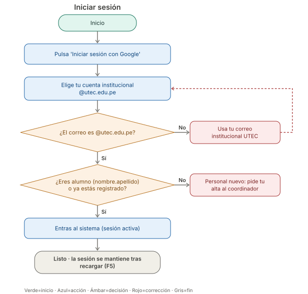
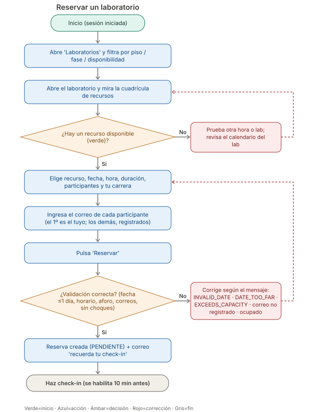
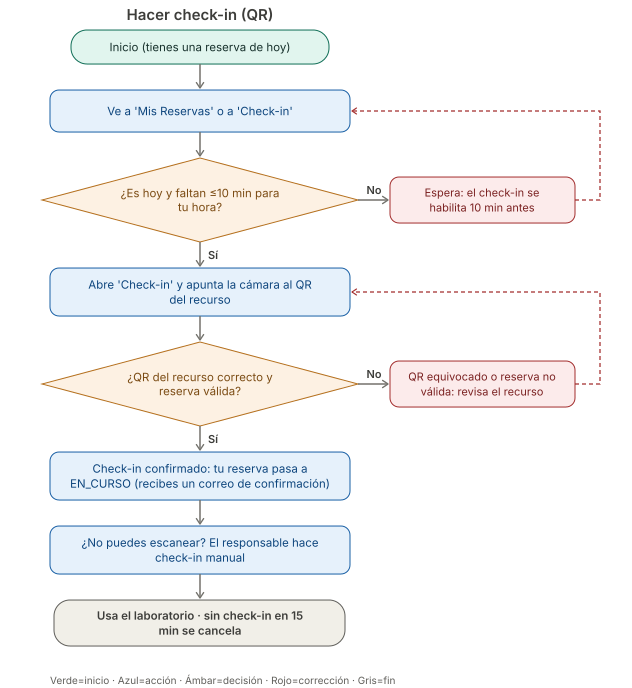
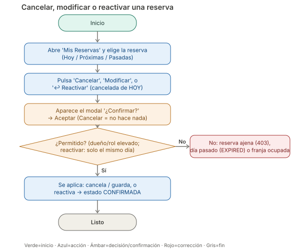
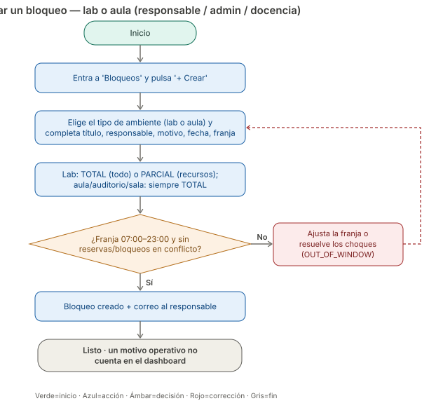
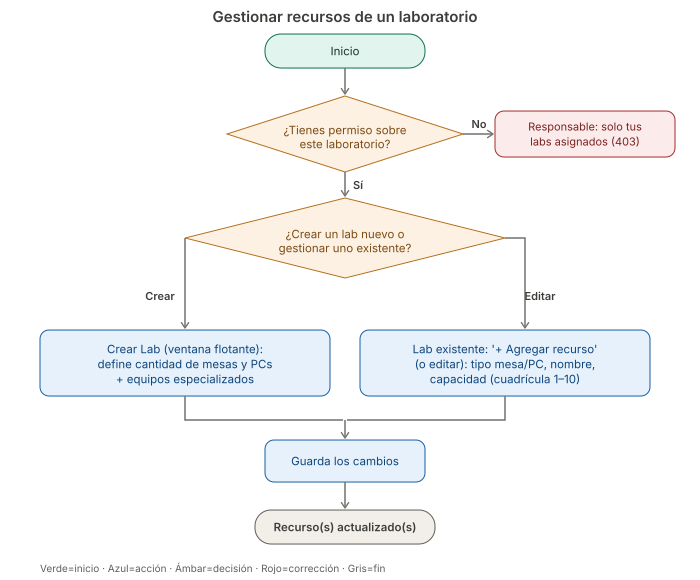
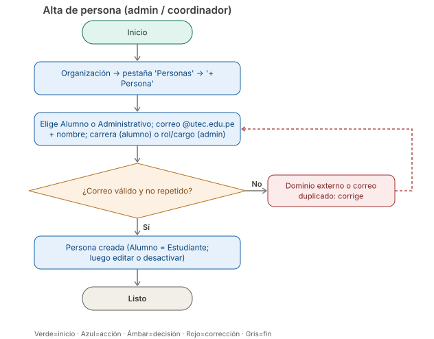

# 17. Guía visual de flujos (diagramas de flujo)

> Diagramas de flujo paso a paso para **usar el software sin errores**. Cada flujo muestra las acciones (azul), las decisiones (ámbar), las correcciones ante error (rojo) y el inicio/fin (verde/gris).
> Versión narrada paso a paso en el [Manual del Alumno](15a-manual-alumnos.md) y el [Manual del Administrativo](15b-manual-administrativos.md); flujos internos del sistema en [Diagramas de Actividades](06-diagrama-actividades.md).

**Leyenda:** 🟢 Inicio · 🔵 Acción · 🟠 Decisión · 🔴 Corrección (qué hacer si falla) · ⚪ Fin.

---

## 1. Iniciar sesión

## 2. Reservar un laboratorio (estudiante)

## 3. Hacer check-in

> Un check-in válido pasa la reserva a `EN_CURSO` y envía al titular el correo **"Check-in confirmado — estás En curso"**. Así el alumno recibe dos correos: uno al **reservar** y otro al **hacer check-in**.

## 4. Cancelar o modificar una reserva

> Toda acción (cancelar, guardar, eliminar) muestra antes un **modal de confirmación**; solo se ejecuta al aceptar.
> **Revertir una cancelación:** si la reserva quedó `CANCELADA` y es **de hoy**, un rol de gestión ve el botón **↩ Reactivar** que la deja `CONFIRMADA` (si el día ya pasó, no aparece).

## 5. Crear un bloqueo (responsable / admin)

## 6. Gestionar recursos de un laboratorio

> Cubre dos caminos: **crear un lab nuevo** (ventana flotante, indicando la cantidad de **mesas y PCs** y los **equipos especializados**) o **gestionar los recursos** de uno existente (agregar/editar una mesa/PC con su capacidad).

## 7. Alta de persona (admin / coordinador)

---

## Otros diagramas visuales
- **Casos de uso (UML):** [diagrams/use-cases-uml.svg](diagrams/use-cases-uml.svg) — actores ↔ casos de uso dentro de la frontera del sistema.
- **Arquitectura:** [diagrams/system-architecture.svg](diagrams/system-architecture.svg)
- **Secuencias:** [reserva](diagrams/reservation-flow-sequence.svg) · [check-in](diagrams/checkin-flow-sequence.svg)
- **Diagrama de tablas / ERD interactivo:** [diagrams/er-diagram.html](diagrams/er-diagram.html) (ábrelo en el navegador).

> Todos los `.svg` se renderizan directo en GitHub. Generados a partir del comportamiento real del backend (validaciones, ventanas horarias, roles).
