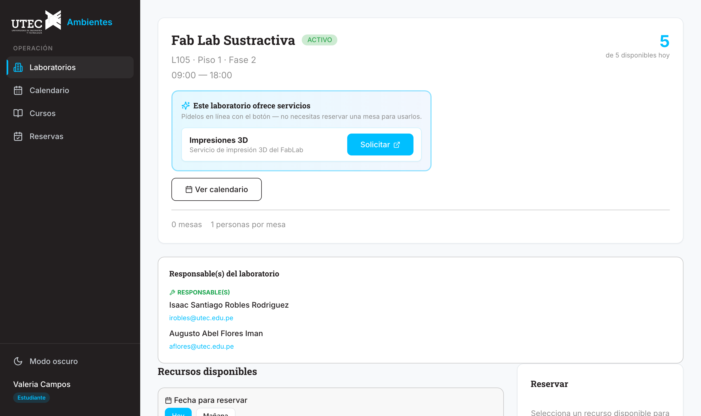
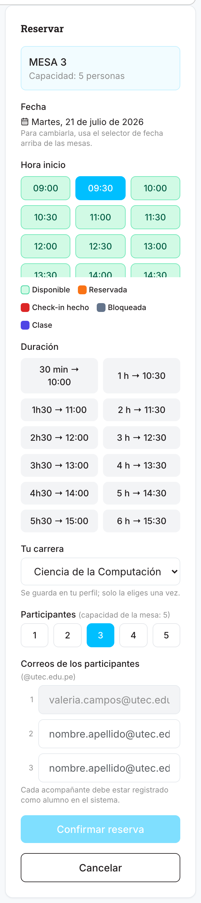
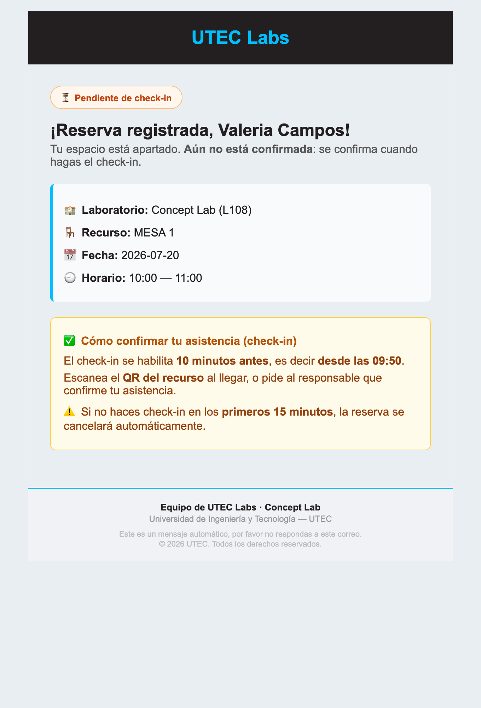
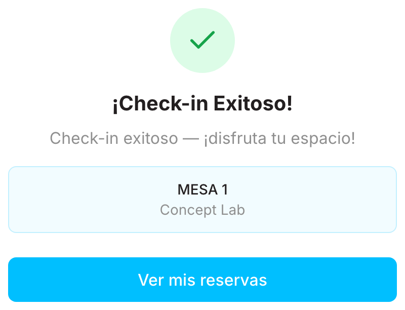
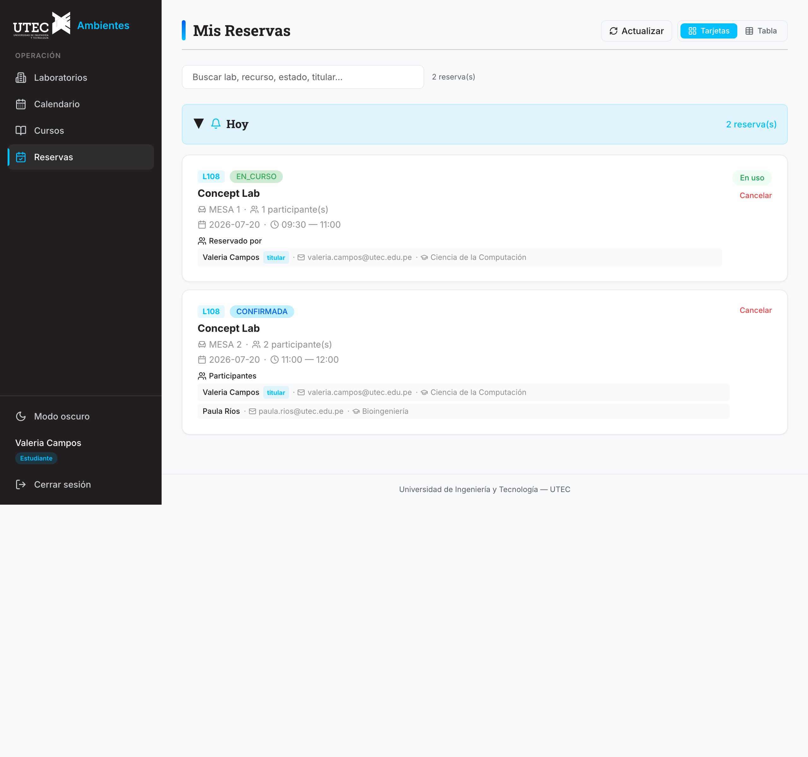
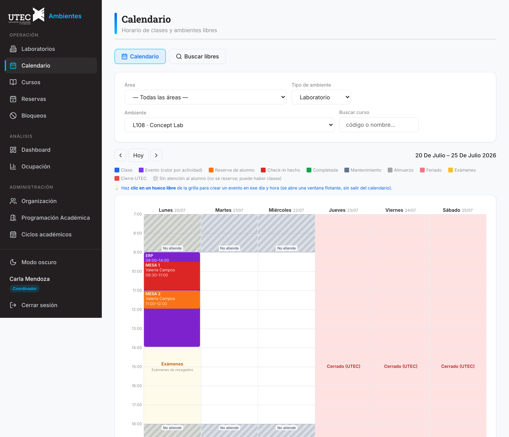

# Manual del Alumno

## UTEC Ambientes

> Guía **ilustrada paso a paso** para **estudiantes**. Aprenderás a iniciar sesión, buscar un laboratorio, **reservar** un recurso, hacer **check-in**, gestionar tus reservas y **consultar el calendario de clases** (aulas, auditorios y laboratorios).
> Hay un manual aparte para el personal administrativo: **Manual del Administrativo**.

---

## Convenciones

- **Botones**: se nombran tal cual aparecen en pantalla (p. ej. **Confirmar reserva**, **📅 Ver calendario**).
- **Colores de un recurso** (mesa/PC): 🟢 disponible · 🟠 reservada · 🔴 con check-in · ⬛ bloqueada · 🚫 cerrado ese día.
- **"¿Confirmar…?"**: antes de cancelar, guardar o editar aparece un cuadro de confirmación; la acción solo se ejecuta al **Aceptar**.

---

## 1. Iniciar sesión

*Pantalla de login.*

1. Abre la aplicación y pulsa **Iniciar sesión con Google**.
2. Elige tu cuenta **@utec.edu.pe** (`nombre.apellido@utec.edu.pe`): ingresas automáticamente como **Estudiante**.
3. Tras recargar (F5) **no** vuelves a iniciar sesión: la sesión se mantiene con una cookie segura.
4. Para salir, pulsa **Salir** (arriba a la derecha).

*Flujo del inicio de sesión.*

---

## 2. Explorar los laboratorios

*Listado de laboratorios. Como alumno ves solo los responsables del lab.*

1. En el menú superior, entra a **Laboratorios**.
2. Para encontrar un lab:
   - **Buscador**: escribe nombre, código, carrera, responsable **o servicio** (p. ej. "Impresiones 3D").
   - **▶ 🔍 Filtros**: por **piso**, **fase**, **carrera**, **servicio** y **disponibilidad**.
   - Desplegable de orden: **Código (mayor a menor)** (por defecto), **Nombre (A-Z)** o **Piso (menor a mayor: Sótano 2 → Piso 1 → 2…)**.
3. Cada tarjeta te dice si puedes usar el lab **ahora**:
   - **Disponibilidad ahora** (`X/Y`): recursos libres en este instante.
   - **Hoy: N/Y con cupo libre**: recursos con algún hueco en lo que queda del día.
   - Si el lab no atiende hoy: **🚫 Fuera de servicio hoy**.
   - **✨ Ofrece:** algunos labs ofrecen **servicios** (p. ej. los FabLab **L105/L207 → Impresiones 3D**). En la tarjeta salen como etiquetas celestes; al abrir el lab verás el panel **"Este laboratorio ofrece servicios"** con un botón **Solicitar** que abre el formulario del servicio — **no necesitas reservar una mesa** para pedirlo.

*El panel de servicios del FabLab: cada servicio con su botón **Solicitar**.*

---

## 3. Reservar un recurso (paso a paso)

### Paso 1 — Elegir fecha y mesa

*Selector de 📅 Fecha para reservar arriba y cuadrícula de recursos.*

> ### ⚡ Importante: solo puedes reservar para HOY o para MAÑANA
> El sistema permite reservar con **máximo 1 día de anticipación**. Arriba de la cuadrícula verás dos chips de fecha — **Hoy** y **Mañana** — y nada más. Si hoy el lab no atiende (p. ej. domingo), cambia a **Mañana** y las mesas se habilitan.

1. Pulsa una tarjeta para abrir el **detalle** del laboratorio.
2. Arriba de la cuadrícula, elige la **📅 Fecha para reservar**: **Hoy** o **Mañana**. El **contador** de arriba (*"N de M disponibles"*) se refiere a la **fecha elegida**, no siempre a hoy.
   - Si el lab no atiende ese día, las mesas aparecen como **🚫 CERRADO** y no se pueden elegir: cambia de fecha.
   - Si UTEC está **cerrada por feriado institucional** ese día, verás un aviso rojo y **ningún laboratorio** se puede reservar (en el calendario esos días salen como **"Cerrado (UTEC)"**).
   - Una mesa con etiqueta **RETIRADA** salió físicamente del lab por un periodo (no se puede reservar hasta que vuelva).
   - Si ese día está **completamente tomado por un evento** (bloqueo TOTAL sobre todo el horario), las mesas salen **⬛ BLOQUEADO** y el contador marca **0 disponibles ese día** (sin necesidad de elegir hora): elige otra fecha.
   - Los estados **"en uso ahora"** (una mesa con check-in en curso HOY) solo aplican a **hoy**: si eliges **Mañana**, esa mesa vuelve a verse **🟢 DISPONIBLE** (el uso de hoy no ocupa la mesa mañana). Los slots ya reservados por otros alumnos ese día se ven ocupados **en la cuadrícula de horas**, al elegir la hora.
3. Pulsa una **mesa/PC disponible** (🟢). Se abrirá el panel **Reservar** a la derecha.

### Paso 2 — Completar la reserva

*Panel Reservar: hora de inicio, duración, carrera, participantes y un correo por persona.*

1. **Hora inicio**: elige una hora 🟢 disponible (las grises ya están ocupadas/bloqueadas).
   - Si reservas para hoy a una hora "rota" (p. ej. 10:05), el fin se ajusta a la malla de 30 min.
2. **Duración**: elige cuánto durará tu reserva.
3. **Tu carrera**: selecciónala (solo la primera vez; queda guardada en tu perfil).
4. **Participantes** (hasta la capacidad de la mesa): al elegir la cantidad aparece **una casilla de correo por persona**:
   - La **primera** es la tuya (titular), ya rellena y bloqueada.
   - Las demás son tus **acompañantes**: escribe su **correo @utec.edu.pe**. Deben estar **registrados** o la reserva se rechaza (un correo inválido se marca en rojo y bloquea el botón).
5. Pulsa **Confirmar reserva** y **Aceptar**. Recibirás un **correo** recordándote el check-in.

> ⚠️ La reserva **aún no cuenta como asistencia**: debes hacer **check-in** el día y la hora.

### Correo que recibes

Al confirmar, el sistema te envía **automáticamente** este correo a tu cuenta **@utec.edu.pe** con el detalle y el recordatorio del check-in:

*Correo "Reserva registrada — recuerda tu check-in" (lo recibe el alumno titular).*

*Flujo completo de la reserva.*

---

## 4. Hacer check-in

El **QR** está pegado en cada mesa. Al **escanearlo con la cámara de tu celular** se abre la pantalla de check-in, que valida tu reserva y muestra el resultado.

*Pantalla de check-in exitoso: tu reserva quedó En curso y recibes el correo de confirmación. Si algo falla (no es tu reserva, no es hoy o aún no es la hora), aquí verás el motivo.*

1. Escanea el **QR del recurso** que reservaste.
2. El check-in se habilita **desde 10 minutos antes** de tu hora.
   - Antes de esa ventana verás "se habilita 10 minutos antes".
   - Si todo está bien, verás **Check-in exitoso** ✓.
3. ⚠️ Si **no** haces check-in, el sistema **cancela** tu reserva a los **15 minutos** (no-show).

*Flujo de check-in.*

---

## 5. Mis Reservas

*Tus reservas, agrupadas en Hoy / Próximas / Pasadas.*

- **Ver participantes**: si la reserva tiene más de una persona, la tarjeta los lista (nombre · 🎓 carrera) con la etiqueta **titular**.
- **Cancelar**: botón **Cancelar** (solo tus reservas) + confirmación.
- **Editar**: cambia fecha, hora o duración; los **correos de los participantes vienen precargados** (el titular de solo lectura). Solo se reemplazan si los cambias.

*Flujo de cancelación de reserva.*

---

## 6. Calendario del laboratorio

*Vista de calendario (semana/mes/día) con reservas y bloqueos del lab.*

- En el detalle del lab, pulsa **📅 Ver calendario** para ver la ocupación del laboratorio.

---

## 7. Calendario y horario de clases

*Sección **Calendario**: el horario de clases del ciclo sobre el calendario académico real (con exámenes y feriados), y la búsqueda de ambientes libres.*

En el menú, entra a **Calendario** para consultar el horario de clases sin tener que reservar:

1. Elige el **Ciclo** (2026-0, 2026-1 o 2026-2). El calendario abre en la **semana actual**.
2. Filtra por **Área / carrera**, por **Tipo de ambiente** (Aula · Aula Mixta · Auditorio · Sala · **Laboratorio**) y luego por el **ambiente** concreto, o busca un curso por código/nombre.
3. Navega con **Anterior / Hoy / Siguiente** (una semana por vez, con las fechas reales arriba de cada columna).
4. Si eliges un **Laboratorio** (p. ej. **L108 – Concept Lab**), verás también sus **eventos y reservas** encima de las clases — la ocupación completa del lab.

### 7.1 Cómo leer los colores del calendario

| Lo que ves | Qué significa |
|---|---|
| 🟦 Bloque **azul** | **Clase** del horario académico. Si dice **(A)** o **(B)** es quincenal: solo se dicta en su semana |
| 🟪 Bloques **morados/magenta** | **Eventos** del ambiente — cada actividad tiene su propio tono (la misma actividad repite color) |
| 🟧 Naranja · 🟥 Rojo · 🟩 Verde | **Reservas de mesas** del lab: reservada · con check-in (en uso) · completada |
| 🌸 Día **rosa** | **Feriado** (no hay clases) |
| 🟨 Día **ámbar** | Semana de **exámenes** (sin clases regulares; el lab sí atiende) |
| 🟥 Día **rojo "Cerrado (UTEC)"** | **Cierre institucional**: la universidad está cerrada — no hay clases ni reservas |
| ▨ Franjas **rayadas grises** | El lab **no atiende** a esas horas (fuera de su horario, p. ej. antes de 9 o después de 6) — no se puede reservar ahí aunque el espacio se vea vacío |

> Si dos actividades se cruzan a la misma hora, la grilla las **reparte en columnas** dentro del día para que ambas se lean.

### 7.2 Buscar ambientes libres

En la pestaña **Buscar libres** eliges el **día** (chips con las fechas de la semana), la **hora de inicio** y la **duración**: el sistema lista los ambientes **sin clase ni evento** en esa franja, como tarjetas con su barra del día ("Libre hasta las HH:MM"). Los laboratorios muestran 3 estados: **libre** (verde), **parcial** (ámbar: hay alguna mesa reservada pero el lab sigue usable) y **ocupado** (gris: clase o evento total). Desde la tarjeta de un lab puedes ir directo a **Reservar mesa**.

En la sección **Cursos** puedes abrir un curso y ver su horario (día, hora, ambiente, sección, docente) del ciclo elegido.

---

## 8. Casos de uso del alumno

| Caso de uso | Sección | Diagrama |
|-------------|---------|----------|
| Iniciar sesión | 1 | `flow-login.svg` |
| Reservar recurso | 3 | `flow-reservar.svg` |
| Hacer check-in | 4 | `flow-checkin.svg` |
| Cancelar / editar reserva | 5 | `flow-cancelar-reserva.svg` |
| Consultar horario / ambientes libres | 7 | CU-21 / CU-22 |

Detalle completo en [04-casos-de-uso.md](../04-casos-de-uso.md) y [05-diagrama-casos-de-uso.md](../05-diagrama-casos-de-uso.md).

---

## Apéndice — Estados de una reserva

| Estado | Significado |
|--------|-------------|
| **Pendiente** | Creada, sin confirmar. |
| **Confirmada** | Aceptada por gestión; sin asistencia marcada. |
| **En curso** | Hiciste check-in; la mesa queda ocupada. |
| **Completada** | Terminó su franja con asistencia. |
| **Cancelada** | Anulada por ti o por **no-show** (sin check-in en 15 min). |

## Apéndice — Preguntas frecuentes

- **El QR da "Check-in Fallido".** Revisa que sea tu reserva, que sea **hoy** y que estés dentro de la ventana (desde 10 min antes). Si la sesión venció, vuelve a iniciar sesión.
- **No puedo reservar a cierta hora.** Revisa el horario del lab, el día de atención y que no haya bloqueo/reserva. Solo se reserva con **1 día** de anticipación.
- **Mi reserva desapareció.** No-show (sin check-in en 15 min). Si fue de hoy, un responsable puede reactivarla.
- **No aparezco en "Reservas por carrera".** La gráfica cuenta **por participante**: revisa que tu carrera esté en tu perfil.
- **¿Qué es una mesa "RETIRADA"?** Esa mesa salió físicamente del laboratorio por un periodo (p. ej. un ciclo) y no se puede reservar; volverá cuando la repongan.
- **Quiero usar un servicio del lab (p. ej. Impresiones 3D).** Abre el laboratorio y en el panel **"Este laboratorio ofrece servicios"** pulsa **Solicitar**: se abre el formulario de solicitud. No hace falta reservar mesa.
