# Manual del Administrativo de Laboratorios

## UTEC Ambientes

> Guía **ilustrada paso a paso** para quien gestiona laboratorios: `RESPONSABLE_LAB`, `DIRECTOR`, `COORDINADOR` y `ADMIN`.
> Manuales hermanos: **15a Manual del Alumno** · **15c Manual de Programación Académica** (Docencia y Docentes).
> **Empieza por la sección 1**: busca TU rol y sigue su guía — te dice exactamente qué haces tú y en qué sección está el detalle.

---

## 1. Tu rol y tu guía (empieza aquí)

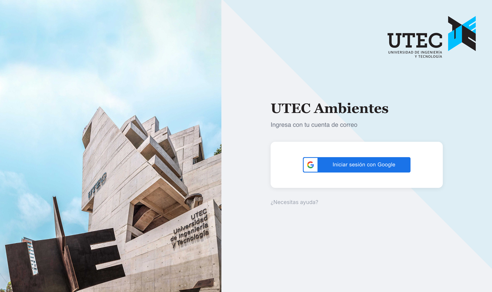

*Pantalla de login.*

1. Pulsa **Iniciar sesión con Google** y entra con tu cuenta **@utec.edu.pe**.
2. El personal administrativo (`inicialApellido@utec.edu.pe`) debe estar **dado de alta** por un coordinador o admin; no se auto-registra. Los **docentes** se crean automáticamente al importar el horario académico.

**Matriz resumen** (✓ = puede; el detalle vive en la guía de cada rol):

| Acción | Responsable | Director | Coordinador | Docencia | Docente | Admin |
|--------|:-:|:-:|:-:|:-:|:-:|:-:|
| Reservar / check-in (como alumno) | ✓ | ✓ | ✓ | ✓ | — (solo consulta) | ✓ |
| Gestionar recursos, retiros y reservas **de sus labs** | ✓ | ✓ | ✓ (todos) | — | — | ✓ |
| Bloqueos de laboratorio | ✓ (sus labs) | ✓ (su área) | ✓ (cualquiera) | — | — | ✓ |
| Bloqueos de **aulas/auditorios** | — | — | — | ✓ | — | ✓ |
| Dashboard / analítica | ✓ (sus labs) | ✓ (sus labs) | ✓ | ✓ (ámbito Aulas) | — | ✓ (labs + aulas) |
| Importar horarios · aulas · ciclos | — | — | ✓ | ✓ | — | ✓ |
| Crear/editar **cualquier** lab y asignar director/responsables | — | — | ✓ | — | — | ✓ |
| Organización (estructura, carreras, personas) | — | — | directorio | directorio | — | ✓ |
| Cierre institucional · Respaldo · Auditoría | — | — | — | — | — | ✓ |

### 1.1 Guía del RESPONSABLE_LAB — "administro mi laboratorio"

Eres la persona a cargo de uno o más labs (estás **asignado** en ellos; en labs ajenos el sistema te deniega el acceso).

**Tu día a día:**
1. **Recursos de tu lab** (§3): agregar/editar/eliminar mesas y PCs, imprimir sus **QR** para pegarlos en las mesas.
2. **Reservas de tus alumnos** (§3): confirmar, hacer **check-in manual** (si el QR falla), cancelar o **reactivar** una cancelada de hoy.
3. **Retirar mesas por un periodo** (§3): si se llevan mesas de tu lab (p. ej. un ciclo), retíralas para que no aparezcan como reservables; repónlas cuando vuelvan.
4. **Servicios de tu lab** (§3): publica los servicios que ofreces (p. ej. *Impresiones 3D*) con su enlace de solicitud.
5. **Bloqueos de tu lab** (§4): crea eventos totales/parciales, almuerzos y mantenimientos.
6. **Dashboard** (§5): analítica acotada a **tus labs** (eliges uno de los tuyos).

**No puedes:** tocar labs ajenos, crear labs, Organización, aulas.

### 1.2 Guía del DIRECTOR — "superviso los labs de mi área"

Dirijes un departamento: ves y gestionas los labs que dependen de ti (los que diriges + los de tus responsables).

**Tu día a día:**
1. Todo lo del responsable (§1.1) pero sobre **los labs de tu área**.
2. **Dashboard** (§5): analítica de tus labs (eliges uno).
3. Coordinas con el coordinador/admin la asignación de responsables.

**No puedes:** labs fuera de tu área, Organización, aulas.

### 1.3 Guía del COORDINADOR — "gestiono todos los laboratorios"

Administras la operación de labs de toda la universidad.

**Tu día a día:**
1. **Todos los labs** (§2–§3): crear laboratorios (con mesas/PCs/equipos), asignar **director y responsables** (la cascada autocompleta el departamento), activar/desactivar.
2. **Bloqueos de cualquier lab** (§4), incluida la **importación masiva** desde Excel/CSV.
3. **Reservas** (§3): gestionar las de cualquier alumno.
4. **Dashboard completo** (§5).
5. **Organización → Personas** (§6): ves el **directorio** de directores y responsables (lectura).
6. **Programación Académica** (§7): importar horarios, aulas y ciclos.

**No puedes:** bloquear aulas (eso es de Docencia/Admin), Estructura de Organización, respaldo/auditoría, cierre institucional.

### 1.4 Guía de DOCENCIA — "programo las clases y las aulas"

Eres el counter de Docencia: tu mundo son las **aulas, cursos y horarios de clase** (no gestionas laboratorios).

**Tu día a día:**
1. **Importar el horario del ciclo** (§7): sube el Excel oficial (`INF_HORARIOS`); el sistema crea aulas, cursos, clases y docentes. Re-subir **no duplica**; con *Sincronizar* eliminas lo que ya no está.
2. **Gestión de aulas** (§7): alta/edición/baja de aulas, auditorios y salas.
3. **Ciclos académicos** (§7): fechas de cada ciclo, semanas de exámenes y feriados.
4. **Bloquear aulas** (§7.1): eventos en aulas/auditorios (siempre totales).
5. **Dashboard ámbito Aulas** (§5): ocupación por aula, heatmap de clases, eventos por mes.
6. **Organización → Personas** (§6): directorio de Docencia y docentes (lectura).

**No puedes:** nada de laboratorios (ni bloqueos ni reservas de labs).

### 1.5 Guía del DOCENTE — "consulto, no reservo"

Eres profesor: tu cuenta se creó automáticamente desde el horario académico. Tu acceso es de **solo consulta**: ves el **Calendario**, tus **Cursos** y la **disponibilidad de los laboratorios**, pero **no reservas** (las reservas de mesas son de los alumnos) ni gestionas nada. Si necesitas un lab para una actividad, pide un **bloqueo** al responsable del lab o al coordinador.

### 1.6 Guía del ADMIN — "todo lo anterior, más el sistema"

Tienes el alcance completo: todo lo del coordinador y de docencia, más lo exclusivo:

1. **Organización completa** (§6): estructura (facultades/direcciones, departamentos, carreras), asignar decanos/directores, alta y edición de personas.
2. **Cierre institucional** (§7): declarar que UTEC cierra por un rango (feriado institucional) — una sola entrada detiene clases, bloquea reservas y ajusta el dashboard.
3. **Respaldo / Restaurar** (§5): descargar y restaurar alumnos+reservas+bloqueos.
4. **Auditoría**: historial de acciones sobre reservas.
5. **Dashboard con ámbito** 🧪 Laboratorios | 🏫 Aulas (§5): eres el único que alterna entre ambos.

---

## 2. Vista de laboratorios (data completa)

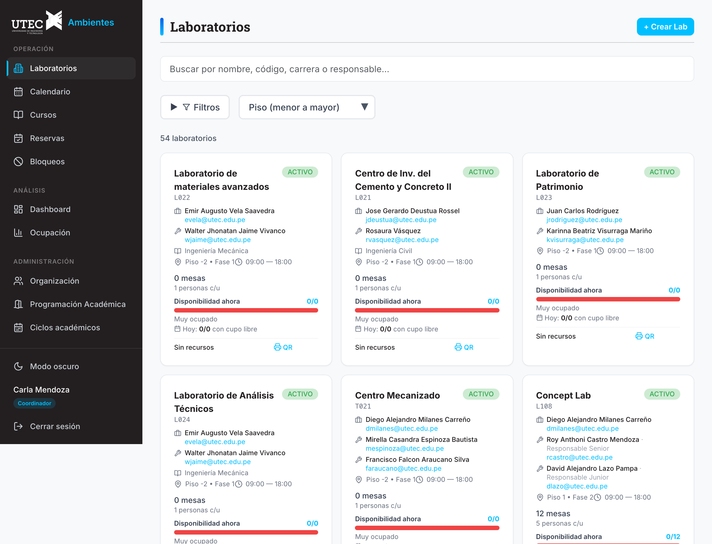

*La tarjeta muestra director y responsables con cargo y correo (el alumno solo ve responsables). Orden por defecto: **Código (mayor a menor)**; primero los **ACTIVOS** y luego los **INACTIVOS**, cada grupo en orden.*

- Los **roles de gestión** ven en cada tarjeta la **información completa**: director + responsables, con su cargo y correo. El correo **clickeable** (mailto) está en el detalle del lab.
- **Filtros** (botón *▶ 🔍 Filtros*): **piso · fase · carrera · disponibilidad · estado**. El filtro **Estado** (Todos / Activos / Inactivos) es exclusivo de los roles de gestión (el alumno solo ve labs activos). El desplegable de **orden** ofrece Código (mayor a menor, por defecto), Nombre (A-Z) y Piso (Sótano 2 → Piso 1…).

---

## 3. Gestionar el laboratorio y sus recursos

*Detalle del lab: cada mesa con su QR, y botones de gestión (+ Agregar recurso, 🖨️ QR de mesas).*

En el **detalle de tu laboratorio**:
- **+ Agregar recurso** → crea una mesa/PC y elige su **capacidad** con la cuadrícula **1–10**.
- En cada recurso: **Editar capacidad** y **Eliminar** (con confirmación).
- **🖨️ QR de mesas** → imprime/guarda los QR (6 por hoja) para pegarlos en las mesas; ese QR es el que el alumno escanea para su check-in.

**Retirar mesas por un periodo** (mesas que salen físicamente del lab, p. ej. por un ciclo):
- Botón **Retirar mesas** (junto a "+ Agregar recurso") → eliges las **mesas** y el **rango de fechas** (con atajo **"Ciclo YYYY-C"** que autocompleta las fechas del ciclo).
- Durante el periodo, esas mesas salen **RETIRADA** en la grilla y **no se pueden reservar**; el dashboard **descuenta su capacidad** (el lab no se ve "vacío" por mesas que no tiene).
- Un retiro **no choca con eventos**: puedes crear un bloqueo total/parcial encima sin desbloquear nada.
- Si la mesa ya tiene **reservas activas** en el rango, el sistema **lo impide y las lista** (cancélalas o reubícalas primero).
- La tira **"Mesas retiradas"** muestra los periodos vigentes; **Reponer** devuelve las mesas.

**Servicios del laboratorio** (p. ej. FabLab → *Impresiones 3D* con su enlace):
- En **Editar laboratorio → Servicios** agregas filas **nombre + enlace + descripción**.
- El detalle del lab los muestra como **chips clickeables** (abren el enlace) y el alumno puede **filtrar por servicio** en la página de Laboratorios.

**Gestión de Reservas** (acciones sobre reservas de alumnos):
- **✓ Confirmar**: *Pendiente → Confirmada* (no marca asistencia).
- **📷 Check-in**: marca la **asistencia** real (reserva de hoy, desde 10 min antes), sin QR.
- **Cancelar**: puedes cancelar la reserva de cualquier alumno.
- **↩ Reactivar**: revive una reserva cancelada **del día de hoy**.

> Un `RESPONSABLE_LAB` solo gestiona los labs donde está **asignado**; en otros recibe *acceso denegado*.

*Flujo de creación/gestión de laboratorios y recursos.*

---

## 4. Bloqueos

Un **bloqueo** reserva el laboratorio (o parte de él) para una actividad, en una fecha y franja (**07:00–23:00**). También puedes bloquear **aulas/auditorios/salas** — ver **§7.1**. Import masivo desde Excel/CSV con el botón **⬆ Importar** (reporte por fila).

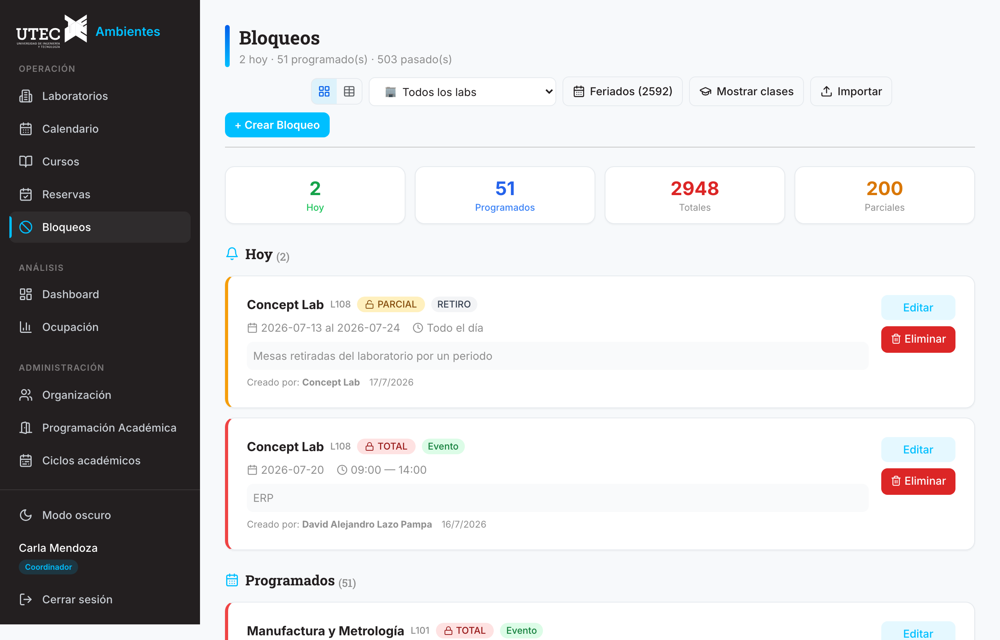

*Bloqueos agrupados en Hoy / Programados / Pasados (orden cronológico).*

> **Alcance por rol:** **ADMIN/COORDINADOR** ven y gestionan bloqueos de **cualquier** laboratorio; **DIRECTOR/RESPONSABLE_LAB** solo de **sus** labs (validado en el servidor: crear/editar/eliminar un bloqueo de un lab ajeno da **403**). El desplegable **"🏢 Todos los labs / [lab]"** de la cabecera filtra por laboratorio (a ti te lista los que puedes ver) — útil para ver un solo lab entre varios.

### 4.1 Bloqueo TOTAL

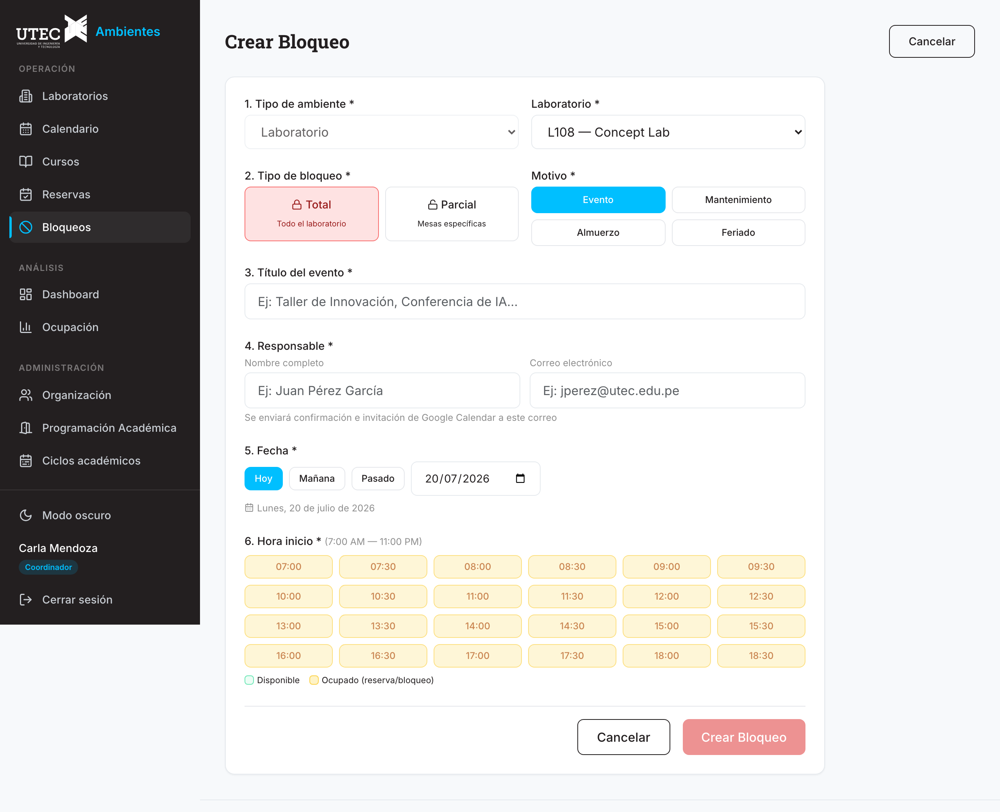

*Tipo Total: reservas todo el laboratorio.*

1. Entra a **Bloqueos** → **+ Crear bloqueo**.
2. **1. Laboratorio**: elígelo (carga sus recursos).
3. **2. Tipo de bloqueo → Total**: el espacio es **todo tuyo**; nadie más puede reservar esa franja.
4. Completa **motivo**, **título del evento**, **responsable**, **fecha** y **hora inicio**.
5. Pulsa **Crear Bloqueo**. El responsable recibe **automáticamente** este correo (también al **editar** y al **eliminar**):

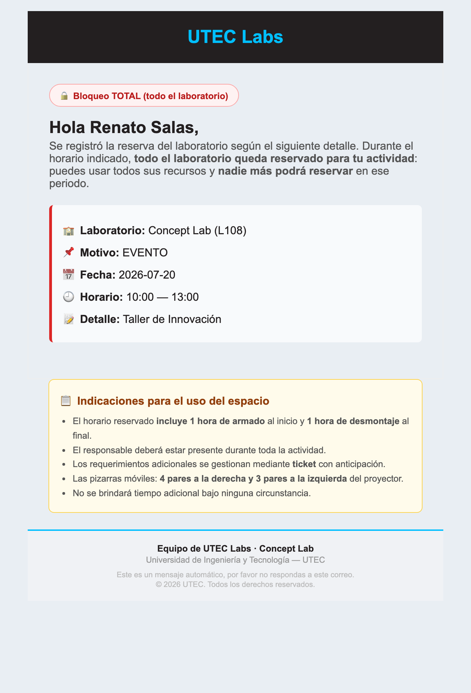

*Correo de bloqueo TOTAL: indica que todo el laboratorio queda reservado, con las indicaciones de uso del espacio.*

### 4.2 Bloqueo PARCIAL

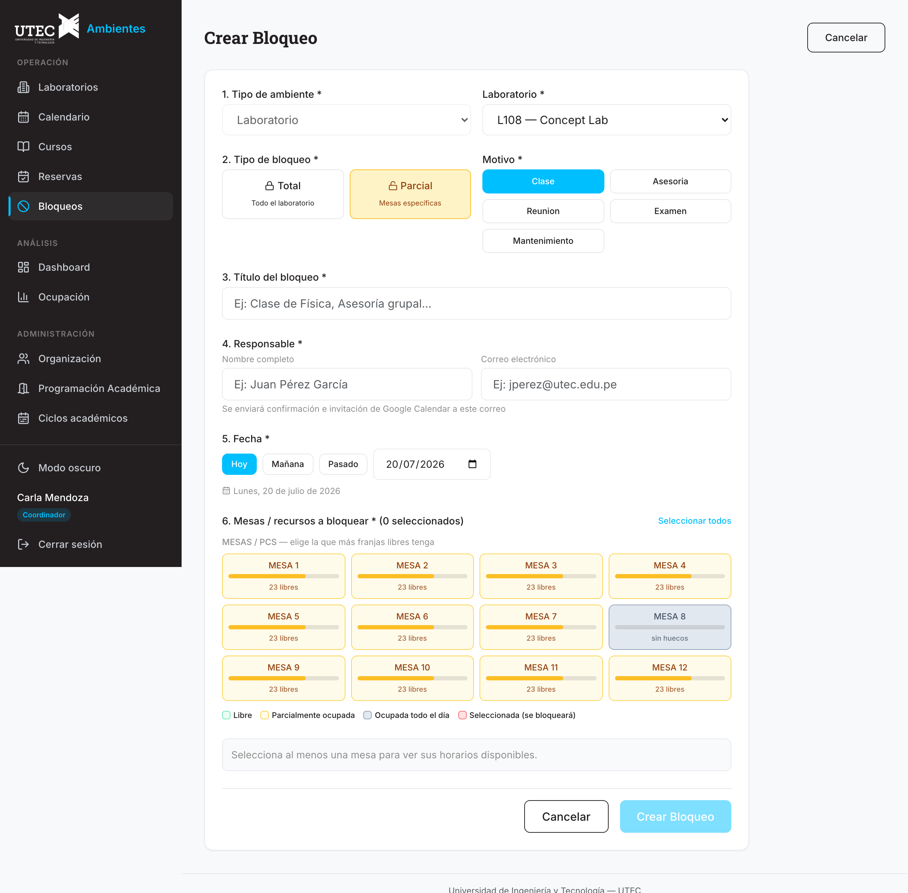

*Tipo Parcial: eliges mesas específicas; el resto del lab sigue disponible.*

1. En **2. Tipo de bloqueo**, elige **Parcial**.
2. Aparece la sección **"Mesas / recursos a bloquear"**: marca las mesas (cada una muestra cuántas franjas tiene libres). El resto del laboratorio **sigue disponible** para los alumnos.
3. Completa motivo, título, responsable, fecha y horario, y pulsa **Crear Bloqueo**. El correo de un bloqueo **PARCIAL** **lista los recursos reservados** y aclara que el resto del lab sigue disponible:

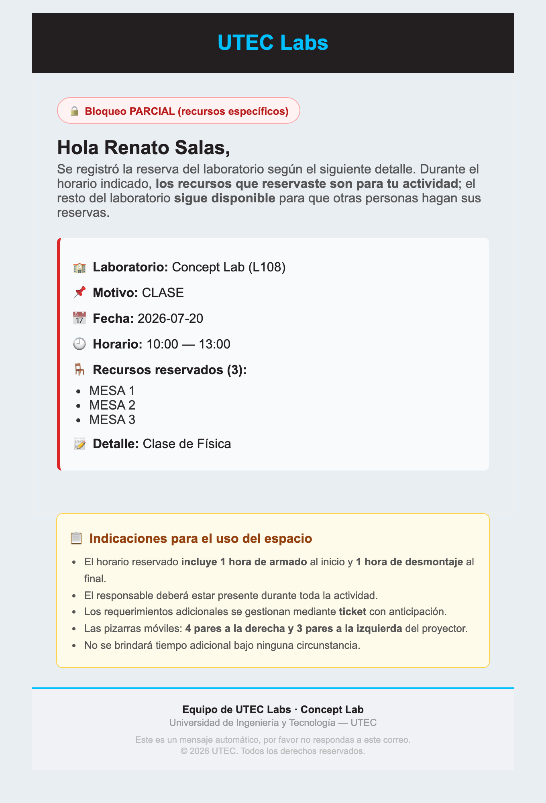

*Correo de bloqueo PARCIAL: lista las mesas reservadas; el resto del laboratorio sigue disponible.*

> **Operativos:** **ALMUERZO**, **MANTENIMIENTO**, **FERIADO** y **RETIRO** cierran el lab (o parte) pero **no** envían correo ni aparecen en las gráficas de eventos del dashboard (sí en su sección "🛠️ Operativo"). Al elegirlos, el responsable y el título se autocompletan. **FERIADO** es solo **TOTAL** (cierra el lab el día completo); los feriados nacionales 2025–2026 ya vienen cargados. **RETIRO** se gestiona desde el **detalle del lab** (botón *Retirar mesas*, ver §3), no desde Crear bloqueo.
>
> **Cierre institucional (todo UTEC):** para un feriado institucional que cierra **toda la universidad** por un rango (aniversario, puente declarado) NO crees bloqueos por lab — agrégalo **una sola vez** en **Ciclos académicos** como excepción tipo **"Cierre institucional"** (ver §7). Detiene clases, impide reservar **cualquier** lab esos días y descuenta la capacidad del dashboard.

*Flujo de creación/edición/eliminación de bloqueos.*

---

## 5. Ver la data — Dashboard

Entra a **Dashboard**. Elige una **vista** (*Resumen (reservas + bloqueos) · **Uso del lab (OEE)***) y aplica los **filtros en cascada**: **laboratorio → año → ciclo → vista → carrera**. Sin filtros, el rango es **"Histórico completo"**; al abrir arranca en el **año y ciclo actual**.

> **Cada vista muestra lo suyo:** *Resumen* une reservas y bloqueos en **secciones con anclas** (*Resumen ejecutivo → 📈 Reservas → 🚧 Bloqueos → 🛠️ Operativo*); *Uso del lab (OEE)* = pantalla ejecutiva de instalación (**% de ocupación + Disponibilidad + capacidad ociosa + mapa de calor**). Cada gráfica lleva un **subtítulo** que indica exactamente **qué mide y qué excluye** (p. ej. "solo reservas de alumnos, no incluye eventos ni clases") — pensado para que quien lee el reporte no tenga que adivinar. Los datos se refrescan con el botón **🔄 Actualizar** y al volver a la pestaña.

### 5.1 Indicadores (KPIs)

*Los 6 indicadores principales (cada tarjeta tiene su leyenda ⓘ).*

- **Reservas**: total de reservas en el periodo filtrado.
- **Bloqueos**: bloqueos de lab (excluye ALMUERZO/MANTENIMIENTO/FERIADO, que son operativos).
- **Completadas**: reservas que terminaron con asistencia.
- **No-shows**: reservas canceladas por no hacer check-in.
- **Ocupación hoy**: foto del momento (en vistas históricas sale 0 %, es correcto).
- **Ausentismo**: no-shows ÷ total de reservas.

### 5.2 Segmentación por tipo

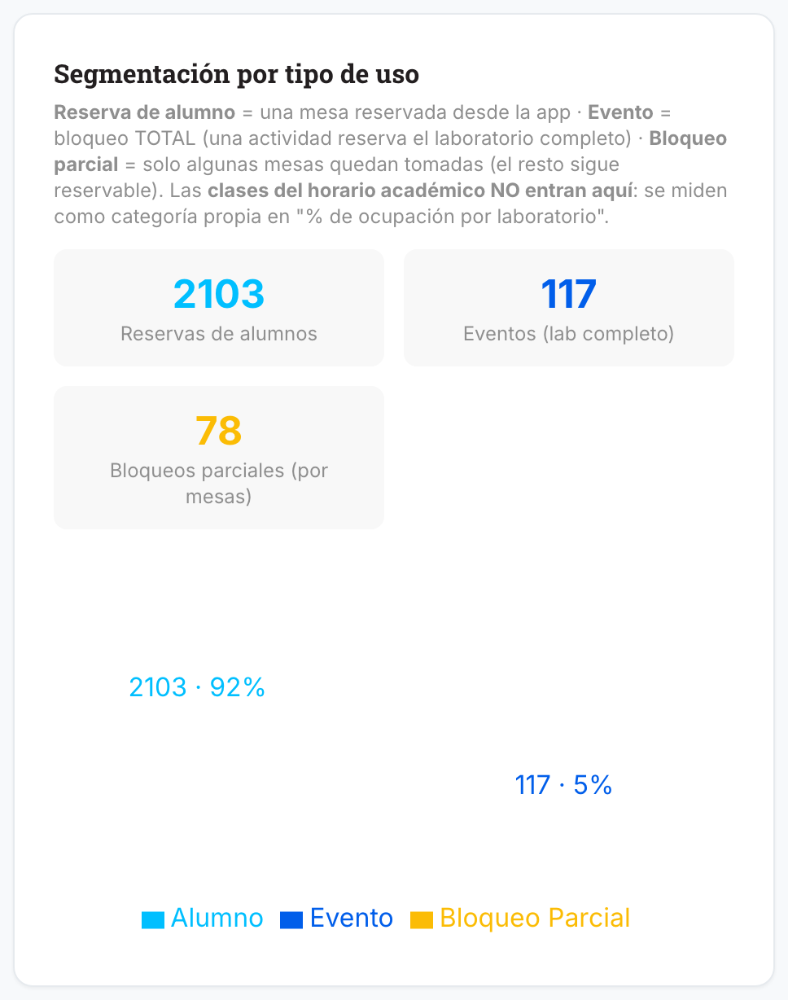

*Cuántas reservas son de alumnos, cuántos eventos (bloqueos totales) y bloqueos parciales.*

### 5.3 Bloqueos

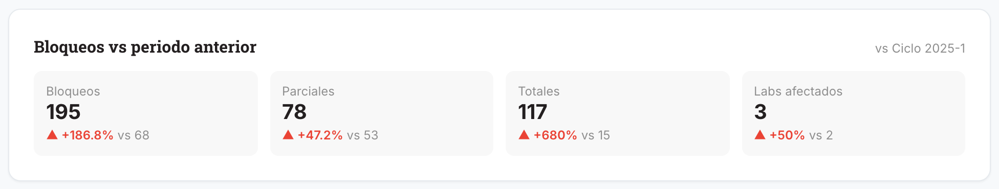

*Resumen de bloqueos: parciales vs totales (donut), el lab más bloqueado y el motivo más frecuente. Va emparejado con "Segmentación" (misma altura).*

### 5.4 Embudo de estados

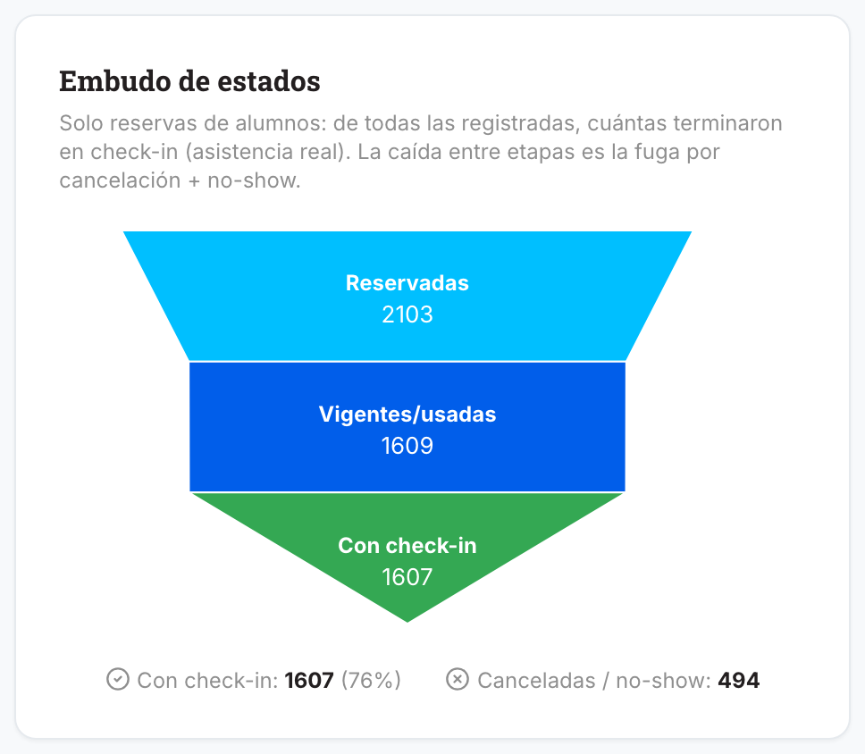

*De todas las reservas, cuántas terminan en **check-in** (uso real). Debajo del embudo se ve la **fuga** — canceladas / no-show — y el **% de aprovechamiento**. La etapa intermedia "Vigentes/usadas" aparece **solo** cuando hay reservas activas (en histórico puro no, para no confundir).*

### 5.5 Reservas por día de la semana

*Patrón semanal agregado (Lun–Dom): útil para planificar horarios y personal.*

### 5.6 % de ocupación por laboratorio

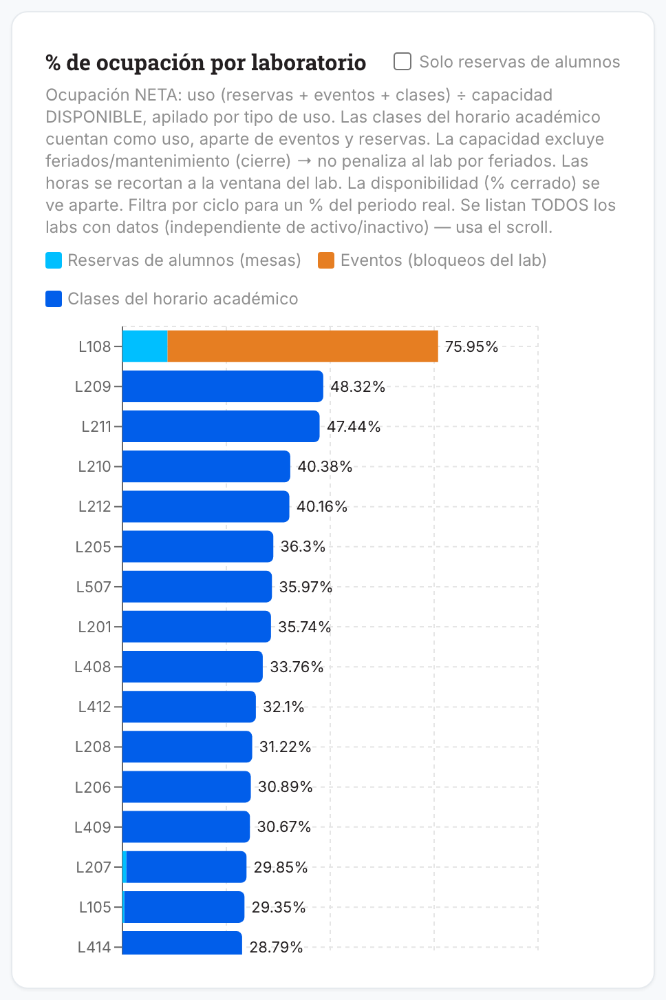

*Tasa de utilización **NETA** = **(horas reservadas + horas de eventos) ÷ capacidad disponible**. Los **bloqueos de evento** (clase/examen/evento) **cuentan como uso** del lab. Los **operativos** (mantenimiento/almuerzo/feriado) son **cierre (downtime)**: se **excluyen de la capacidad** (el lab estuvo cerrado, no es capacidad ociosa) → el % no penaliza al lab por feriados. El cierre se muestra **aparte** en la gráfica **"Disponibilidad por laboratorio"** (% del periodo cerrado por feriado/mantenimiento), siguiendo el modelo OEE (separar *disponibilidad* de *utilización*). Así un lab lleno de eventos no parece ocioso. **Normalizada por tamaño**: un lab chico bien usado supera a uno grande subutilizado (no se castiga a los pequeños por tener menos horas absolutas). Aparecen todos los labs activos. Filtra por **ciclo** para un % del periodo real — en "Histórico completo" es un promedio de largo plazo (más bajo). El tooltip desglosa reservas + eventos / capacidad disponible.*

> **Según la vista:** esta fórmula combinada (reservas + eventos) es la de **Todo** y **Solo bloqueos**. En la vista **Solo reservas** el % cuenta **solo las reservas de alumnos** y la **capacidad reservable descuenta las horas de evento** (en esas horas el alumno no puede reservar); el título cambia a *"% de ocupación por laboratorio (solo reservas)"*.
>
> **Ventanas horarias:** las horas de cualquier bloqueo se **recortan al horario del laboratorio** (p. ej. 9am–6pm) aunque el bloqueo se haya dado en la ventana institucional 7am–11pm. Así un evento de 7am–11pm cuenta solo las 9 horas que caen dentro del horario del lab, no las 16, y el % es coherente. El dashboard muestra una **leyenda fija** (ⓘ *Cómo se calcula la ocupación*) con estas reglas.

### 5.7 Disponibilidad por laboratorio (modelo OEE)

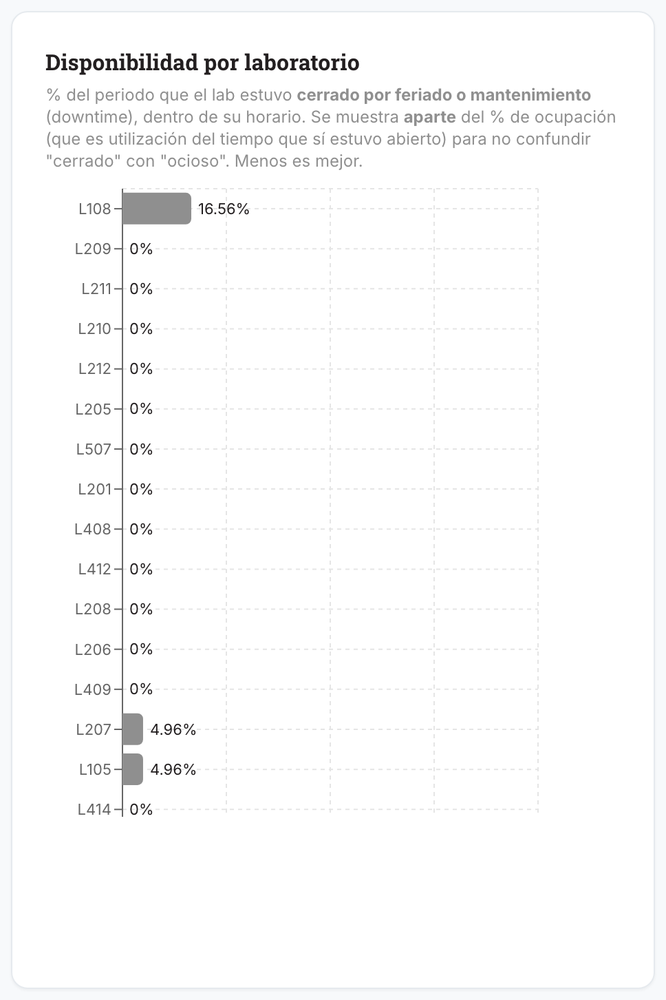

*Complemento del % de ocupación: **% del periodo que el lab estuvo cerrado** por feriado o mantenimiento (downtime), dentro de su horario. Se muestra **aparte** para no confundir "cerrado" con "ocioso" (modelo OEE = separar **disponibilidad** de **utilización**). **Menos es mejor.** Lectura ejecutiva: "el lab estuvo cerrado X % del periodo; del tiempo que sí estuvo abierto, se usó Y %".*

### 5.8 Tamaño de grupo

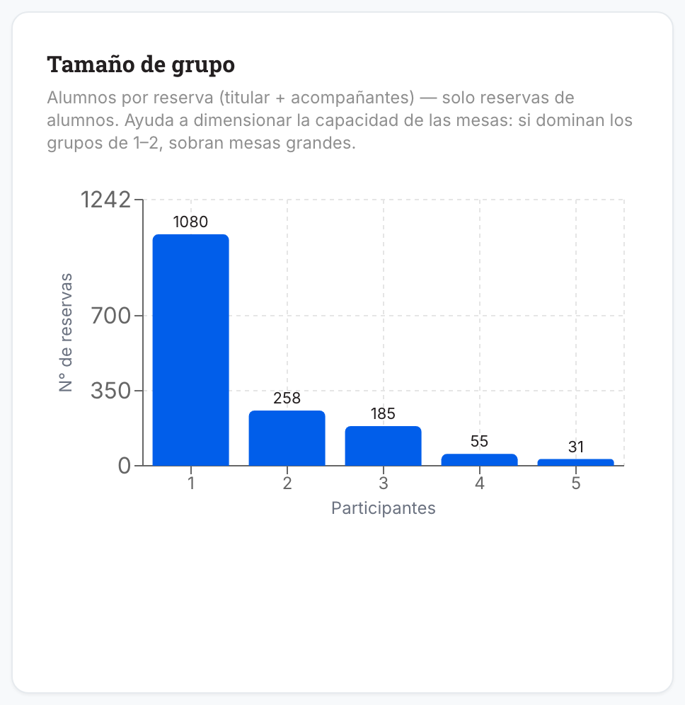

*Cuántos participantes tiene cada reserva (1, 2, 3…): ayuda a dimensionar la capacidad de las mesas.*

### 5.9 Reservas por carrera

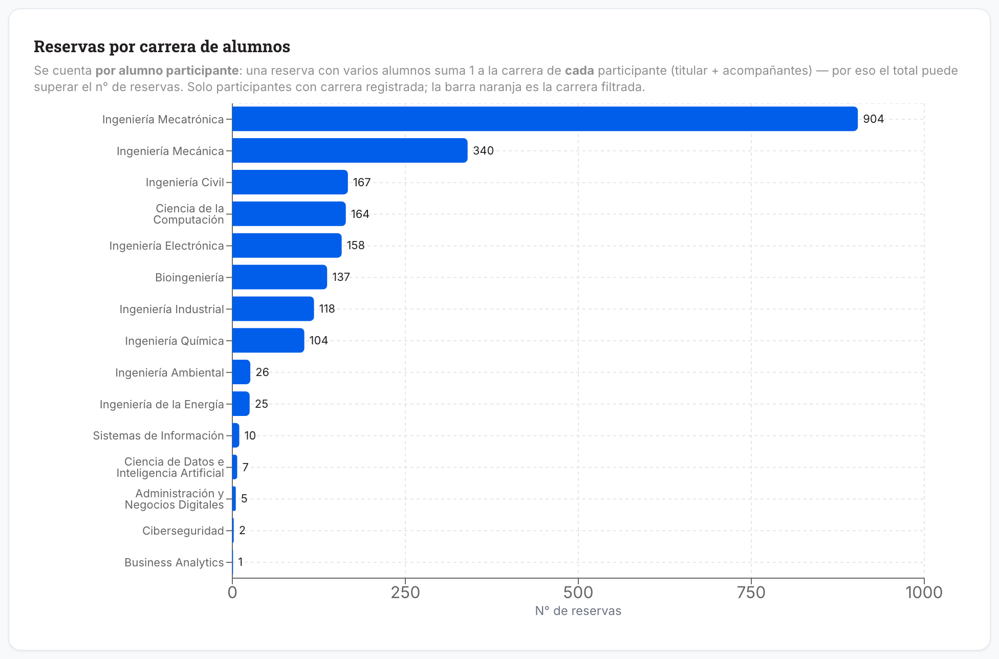

*Reservas agrupadas por carrera del participante (cuenta por participante: una reserva de N alumnos suma a N carreras).*

### 5.10 Concentración de la demanda (Pareto)

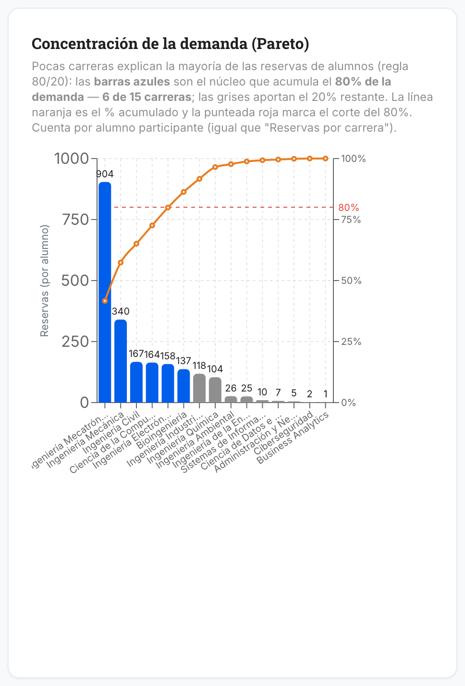

*Pocas carreras explican la mayoría de las reservas. Las barras son las reservas por carrera (desc) y la línea es el **% acumulado**; donde cruza el **80 %** están las carreras que concentran el grueso de la demanda. En *Solo bloqueos* el equivalente es el **Pareto de motivos**.*

### 5.11 Carrera × Laboratorio

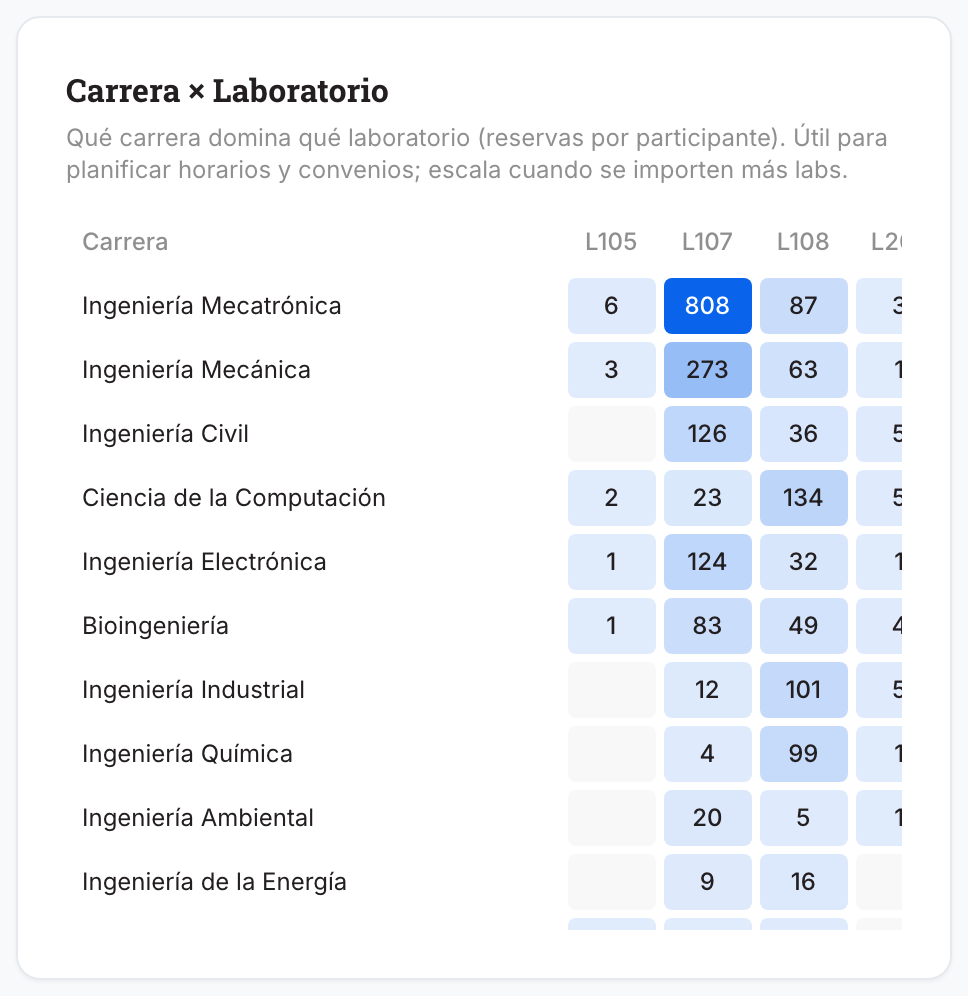

*Mapa de calor cruzado: qué **carrera** domina qué **laboratorio** (reservas por participante). Útil para planificar horarios y convenios; gana columnas cuando se importan más labs.*

### 5.12 Capacidad ociosa por laboratorio

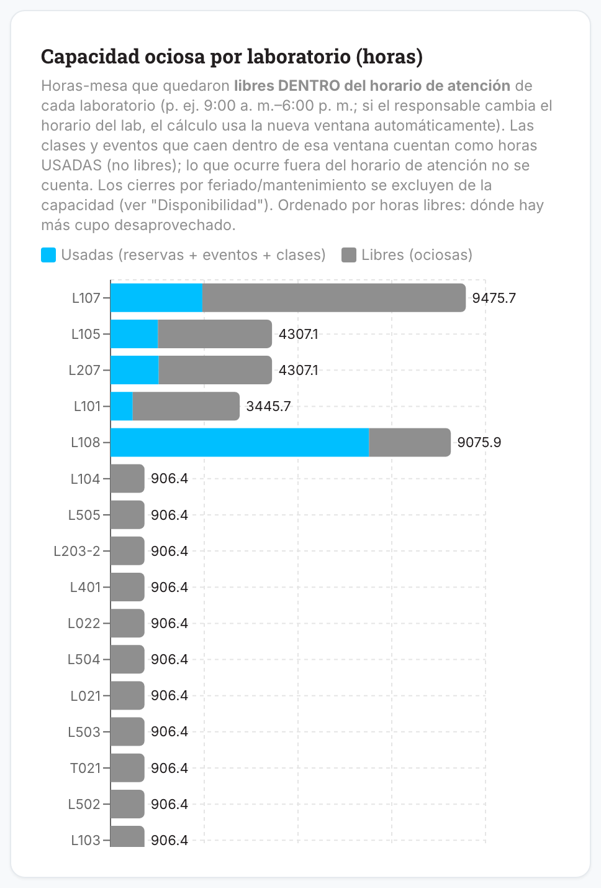

*Horas-recurso disponibles que quedaron **sin usar** (capacidad − uso), dentro del horario del lab y sin contar feriados/mantenimiento. Es la **oportunidad cuantificada**: dónde hay cupo libre para más actividad.*

### 5.13 Mapa de calor — Uso por día y hora

*Cruce día de la semana × hora: cuanto más intenso el color, más reservas. Revela las horas pico.*

### 5.14 Reservas por hora

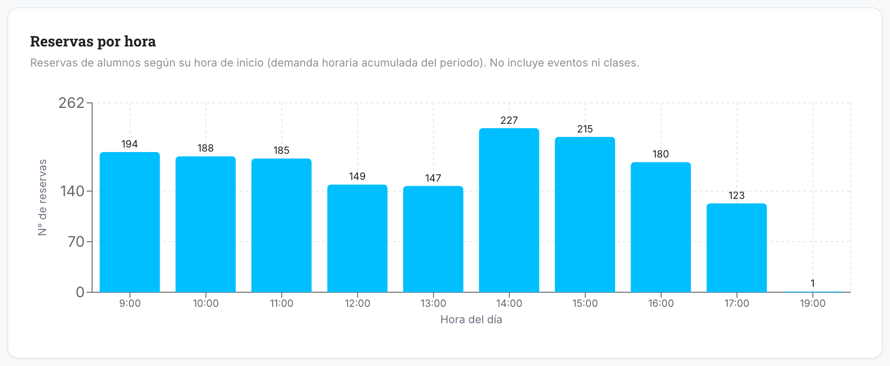

*Distribución de reservas a lo largo del día (eje X = hora; eje Y = N° de reservas). El número sobre cada barra es el total.*

### 5.15 Reservas por día

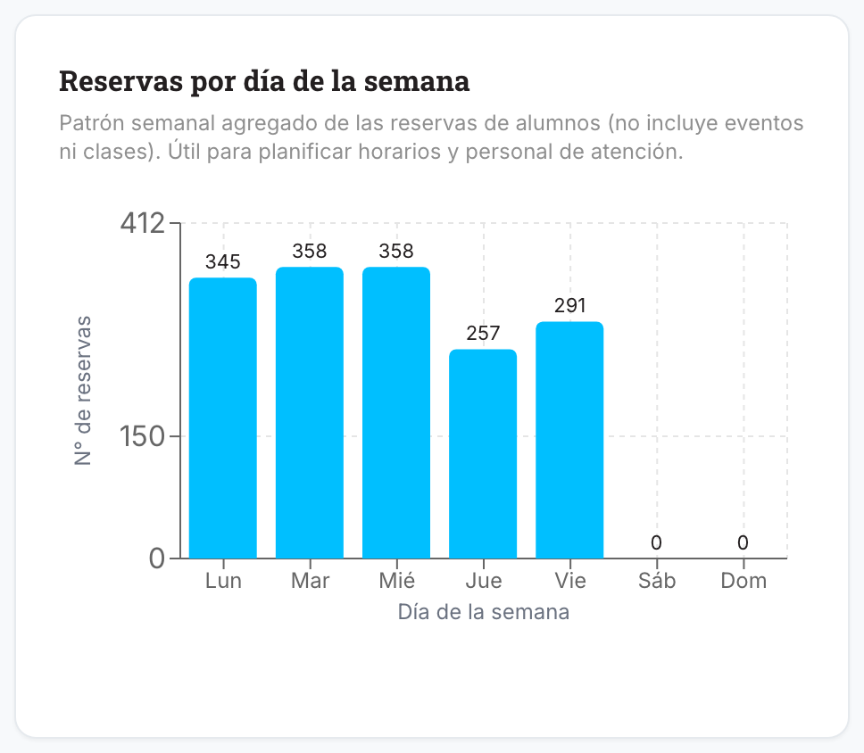

*Reservas por fecha, **apiladas** en Completadas / Canceladas / No-shows. Con muchos días se **desliza en horizontal** (barras legibles) y el eje X muestra 1 fecha cada ~3 días.*

### 5.16 Reservas por mes

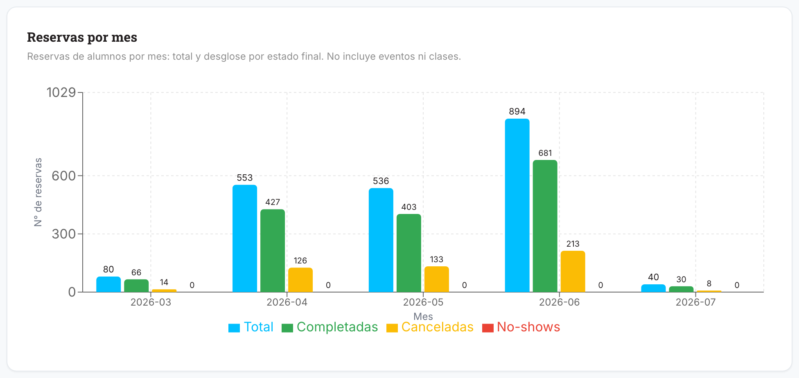

*Comparativa mensual (Total / Completadas / Canceladas / No-shows) con el **número encima de cada barra**. Útil para ver estacionalidad por ciclo.*

### 5.17 Proyección de demanda

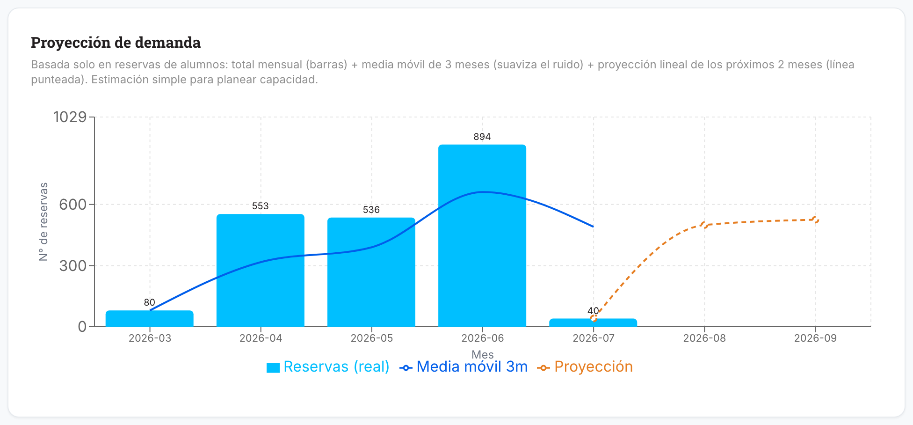

*Total mensual (barras) + **media móvil de 3 meses** (suaviza el ruido) + **proyección lineal** de los próximos 2 meses (línea punteada). Estimación simple para planear capacidad; requiere ≥3 meses de datos.*

### 5.18 Tendencia de reservas

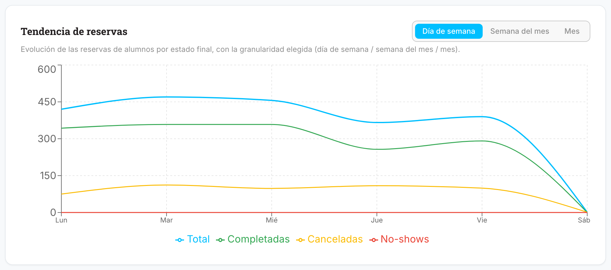

*Evolución en el tiempo (granularidad: día de semana / semana / mes) de las series Total/Completadas/Canceladas/No-shows.*

### 5.19 Operativo — Mantenimiento, Almuerzo y Feriado

> Visible en la vista **Solo bloqueos** (selector *Vista → Solo bloqueos*).

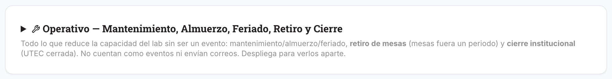

*Los bloqueos **operativos** (`MANTENIMIENTO`, `ALMUERZO` y `FERIADO`) se muestran **aparte**: no cuentan como eventos (no entran en Parcial/Total) ni envían correo. Incluye KPIs por motivo, gráficas apiladas **por laboratorio** y **por mes** (Feriado en azul) y el historial detallado. Los **feriados nacionales 2025–2026** ya vienen cargados como cierres `TOTAL` 09:00–18:00.*

### 5.20 Dashboard ejecutivo (para dirección)

Pensado para **rector / decanos / directores**: no solo describe, **diagnostica y proyecta**. Aparece sobre las gráficas en las vistas **Todo** y **Solo reservas** (la vista *Solo bloqueos* tiene su **propio** resumen de cierres) y **respeta los filtros** (lab/ciclo/año/carrera).

- **Comparación con el periodo anterior (Δ):** las 4 métricas clave (Reservas, Completadas, Aprovechamiento, Ocupación) con su variación **▲ verde / ▼ rojo**. La comparación es automática: año → año anterior, ciclo → mismo ciclo del año pasado.
- **🔎 Conclusiones:** frases auto-generadas de los datos (qué lab está ocioso, qué día concentra la demanda, qué carrera lidera…) para leer de un vistazo.
- **Sello de procedencia:** fuente, rango real de datos, fecha de corte y n° de registros → el reporte declara de dónde y de cuándo son los datos (defendible ante autoridades).
- **Gráficas de analista** (cada una con su propia sección): **Pareto** (5.10), **Carrera × Laboratorio** (5.11), **capacidad ociosa** (5.12), **proyección de demanda** (5.17) y **franjas pico** en el mapa de calor (5.13).
- **🖨️ Reporte ejecutivo:** genera un **PDF de una página** (Guardar como PDF del navegador) con Δ, conclusiones, top de ocupación/carreras y procedencia — listo para circular en un consejo.

> ⚠️ *lead time* y *ausentismo histórico* no se muestran con los datos importados (Affluences no los trae fiables); se activan cuando el sistema opere en vivo.

### 5.21 Vista "Uso del lab (OEE)"

Selecciona *Vista → **Uso del lab (OEE)*** para una **pantalla ejecutiva de instalación** de una sola mirada: **% de ocupación** (utilización) junto a **Disponibilidad** (cierres), más **capacidad ociosa** (horas libres) y el **mapa de calor** con las franjas pico. Sin las gráficas de demanda (embudo, carreras…) → pensada para el rector/decano que quiere el rendimiento del laboratorio de un vistazo.

### 5.22 Acciones del dashboard
- **🔄 Actualizar**: recarga los datos al instante (muestra "Actualizado hace X").
- **⬇ Descargar gráficos**: exporta un PNG con la cabecera de filtros.
- **🖨️ Reporte ejecutivo**: genera el one-pager en PDF (ver 5.20).
- (**ADMIN**) **⬇ Respaldo** / **⬆ Restaurar**: descarga/importa alumnos, reservas y bloqueos en JSON.

---

## 6. Organización (Coordinador / Admin)

*Organización: pestañas Estructura / Labs / Personas (Facultad de Ingeniería expandida). Cada pestaña trae una **ayuda** (💡) que explica qué hacer.*

> **Solo ADMIN:** la pestaña **Estructura** y su CRUD (facultades, departamentos, carreras, asignar decano/director) son exclusivos del **ADMIN**. Un **COORDINADOR** usa Labs y Personas.

- **Estructura**: jerarquía **Facultades → Departamentos → Carreras → Laboratorios**; asigna **decanos/directores**; **+ Carrera** (con su facultad y departamento). Las acciones de **crear/asignar/guardar** son **directas** (sin ventana de confirmación encima); solo **eliminar/desactivar** piden confirmar.
  - **Facultad vs Dirección:** al crear/editar una facultad se elige su **tipo** — **Facultad** (su líder es **Decano/a**) o **Dirección / Área** administrativa (su líder es **Director/a**, no decano). Así áreas como *Marketing* o *Dirección General Académica* no se rotulan como "facultad con decano".
  - **Eliminar un departamento** desde la app **desvincula** sus labs y usuarios (quedan sin departamento) antes de borrarlo; si algo lo impide, muestra un mensaje claro (ya no un error interno).
- **Crear laboratorio** (**+ Crear Lab**): se abre un **modal**; admite **recursos mixtos** (mesas + PCs) y equipos especializados. Al asignar el **responsable** se **autocompleta** director → departamento (auto-cascada), y ese departamento queda **heredado** en la ficha de la persona.
- **Personas**: toggle **Administrativos | Alumnos** (con etiquetas **Ver** / **Estado** y una descripción de cada grupo). Los **Administrativos** se muestran **agrupados por rol** (Director, Coordinador, Responsable…) con su **departamento** visible. **+ Persona** da de alta **Alumno** (con su **carrera**) o **Administrativo** (rol/cargo/depto). A un alumno solo se le corrige el **nombre** y su carrera.
  - **Alumnos paginados:** como hay **miles** (~9500+), la lista de Alumnos se pide **por páginas** al servidor (50 por página, con **Anterior / Siguiente** y "X–Y de N"). La **búsqueda** y el filtro **Activos/Inactivos** filtran en el servidor, así que escribe para encontrar a alguien en vez de desplazarte. Los **Administrativos** (pocos) sí se cargan completos. *(Carga masiva de alumnos: `db/agregar_alumnos.sh --csv`, idempotente y para archivos grandes.)*
- (**ADMIN**) **Auditoría**: historial de acciones sobre reservas.

*Flujo de alta de persona (alumno / administrativo).*

---

## 7. Programación Académica y Ciclos → Manual 15c

La gestión del **horario académico** (importar el Excel del ciclo, aulas, cursos, semanas A/B), los **Ciclos académicos** (fechas, exámenes/feriados con derivación automática, **cierre institucional**) y el **bloqueo de aulas/auditorios** viven en su propio manual:

> 📙 **Manual de Programación Académica (15c)** — para el counter de **Docencia** y los **Docentes**. Si eres **ADMIN**, ese manual también te aplica (heredas todo lo de Docencia, incluido declarar el **cierre institucional** desde Ciclos).

---

## 8. Casos de uso administrativos

| Caso de uso | Sección | Diagrama |
|-------------|---------|----------|
| Crear / gestionar laboratorio y recursos | 3 / 6 | `flow-gestion-recurso.svg` |
| Crear / editar / eliminar bloqueo (lab o aula) | 4 / 7 | `flow-bloqueo.svg` |
| Alta de persona (alumno/administrativo) | 6 | `flow-alta-persona.svg` |
| Importar horarios / gestionar aulas y ciclos | 7 | CU-23 / CU-24 / CU-25 |
| Analítica y respaldo | 5 | — |

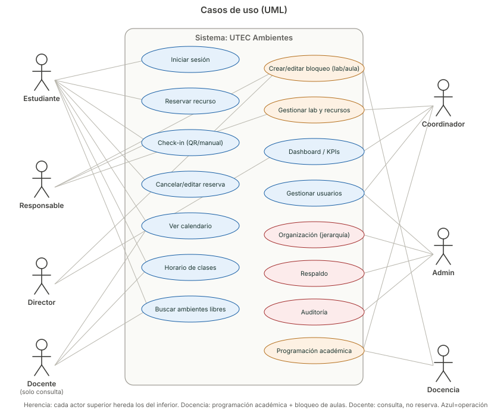

*Diagrama UML de casos de uso del sistema (arquitectura general en [`diagrams/system-architecture.svg`](../diagrams/system-architecture.svg)).*

---

## Apéndice — Estados de una reserva

| Estado | Significado |
|--------|-------------|
| **Pendiente** | Creada, sin confirmar. |
| **Confirmada** | Aceptada por gestión; sin asistencia marcada. |
| **En curso** | Se hizo check-in; la mesa queda ocupada. |
| **Completada** | Terminó su franja con asistencia. |
| **Cancelada** | Anulada por el usuario/gestor o por **no-show** (sin check-in en 15 min). |

## Apéndice — Preguntas frecuentes

- **Un alumno no puede entrar y es del personal.** Un coordinador debe darlo de alta (los administrativos no se auto-registran).
- **No puedo gestionar un lab.** Como responsable, solo gestionas los labs donde estás **asignado**.
- **¿Por qué un bloqueo no sale en el dashboard?** Si es **ALMUERZO**, **MANTENIMIENTO**, **FERIADO** o **RETIRO** es operativo: no se contabiliza en las gráficas de eventos. Todos aparecen en la sección **"🛠️ Operativo"** del Resumen (KPIs + barras apiladas por lab/mes + historial), que además lista los **cierres institucionales** con sus días.
- **Se llevaron mesas de mi lab por un tiempo.** Usa **Retirar mesas** en el detalle del lab (§3): las mesas quedan fuera del sistema durante el periodo y vuelven solas (o con **Reponer**).
- **UTEC cierra por un feriado institucional largo.** No crees 54 bloqueos: agrega **una** excepción tipo **Cierre institucional** en Ciclos académicos (§7).
