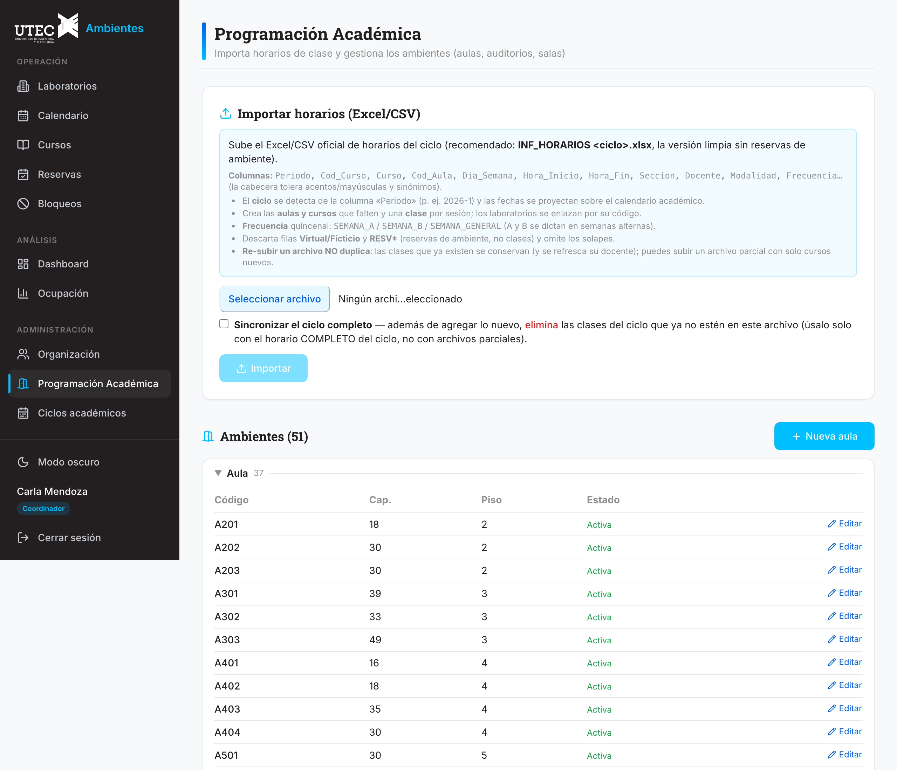
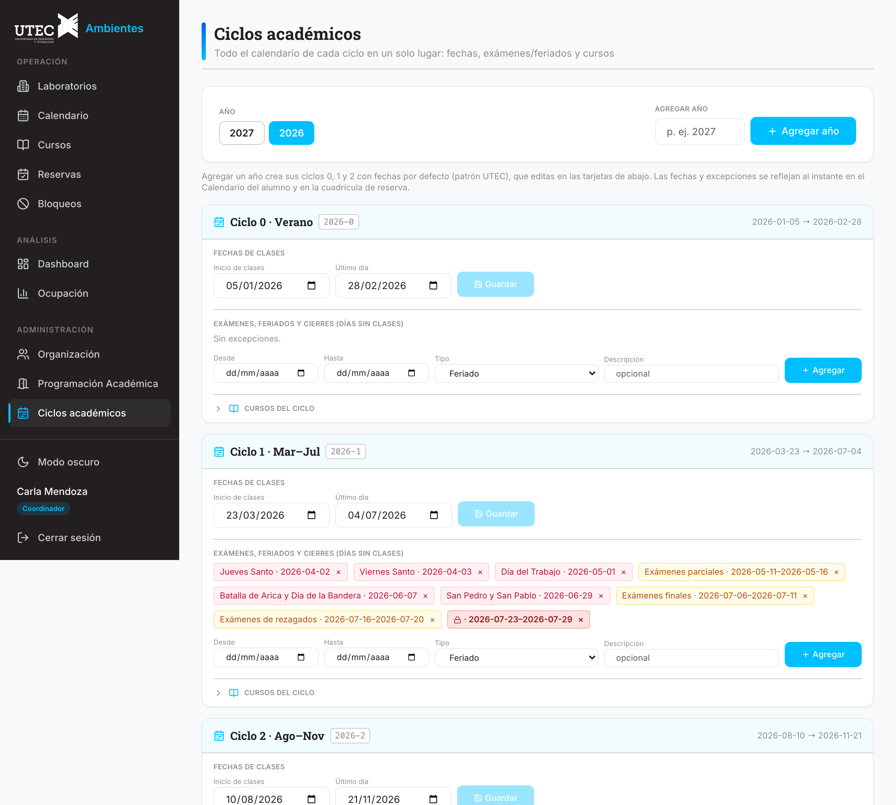

# Manual de Programación Académica

## UTEC Ambientes

> Guía para el **counter de Docencia** (gestiona aulas, cursos y horarios) y para los **Docentes** (consulta).
> Manuales hermanos: **15a Manual del Alumno** · **15b Manual del Administrativo de Laboratorios**.

---

## Índice

1. [Tu rol: Docencia vs Docente](#1-tu-rol-docencia-vs-docente)
2. [Importar el horario del ciclo](#2-importar-el-horario-del-ciclo)
3. [Gestionar las aulas](#3-gestionar-las-aulas)
4. [Ciclos académicos: fechas, exámenes, feriados y cierres](#4-ciclos-académicos)
5. [Bloquear aulas y auditorios](#5-bloquear-aulas-y-auditorios)
6. [Dashboard de Aulas](#6-dashboard-de-aulas)
7. [Para el Docente: qué ves y qué puedes hacer](#7-para-el-docente)
8. [Preguntas frecuentes](#8-preguntas-frecuentes)

---

## 1. Tu rol: Docencia vs Docente

| | **DOCENCIA** (counter) | **DOCENTE** (profesor) |
|---|---|---|
| Cómo nace tu cuenta | Te da de alta un admin | **Automática** al importar el horario |
| Importar horarios · aulas · ciclos | ✅ | — |
| Bloquear aulas/auditorios | ✅ | — |
| Dashboard (ámbito Aulas) | ✅ | — |
| Ver calendarios, cursos y disponibilidad | ✅ | ✅ |
| Solicitar servicios de un lab | ✅ | ✅ |
| Reservar mesas de laboratorio | ✅ (como cualquier usuario) | ❌ **solo consulta** |

> **Docencia no gestiona laboratorios**: tu mundo son las aulas, los cursos y el horario. Los labs los administran los responsables/coordinadores (manual 15b).

---

## 2. Importar el horario del ciclo

*Apartado **Programación Académica**: importa el horario, gestiona las aulas y configura los ciclos.*

1. Entra a **Programación Académica** y sube el **Excel oficial del ciclo** (recomendado `INF_HORARIOS <ciclo>.xlsx`, la versión limpia sin filas RESV).
2. El sistema hace todo el trabajo:
   - Detecta el **ciclo** desde la columna *Periodo*.
   - Crea las **aulas** y **cursos** que falten.
   - Crea una **clase** por cada sesión (recurrente: día de la semana + franja + frecuencia **Semana A/B** para quincenales).
   - **Da de alta a los docentes** (columna Docente + correo) — sus cuentas quedan listas para entrar.
   - Descarta filas *Virtual/Ficticio/RESV* y omite cruces de horario.
3. Al terminar ves el **resumen**: clases creadas, aulas/cursos/docentes nuevos, omitidas y errores.

**Re-importar es seguro:** subir el mismo archivo **no duplica** (las clases se reconocen por su firma); un archivo parcial agrega solo lo nuevo. Con el checkbox **"Sincronizar el ciclo completo"** además se **eliminan** las clases que ya no están en el archivo — úsalo solo con el horario completo del ciclo.

> **Semanas A/B:** las clases quincenales alternan semana por medio (A = semanas impares del año, B = pares), verificado contra la Programación Semanal oficial. El calendario las muestra con "(A)"/"(B)" y solo en su semana.

---

## 3. Gestionar las aulas

En la pestaña de **aulas** del mismo apartado:

- **Alta**: código (p. ej. `A502`), nombre, **tipo** (Aula · Aula Mixta · Aula Posgrado · Auditorio · Aula Magna · Sala/SUM · Estudio de grabación · Losa deportiva), capacidad y piso.
- **Edición** de cualquier campo; el listado agrupa los ambientes **por tipo** (desplegables, orden por piso; el Aula Magna se agrupa con los auditorios).
- **Baja**: es **soft-delete** (el aula se desactiva pero sus clases e historial se conservan).

---

## 4. Ciclos académicos

*Cada ciclo es una tarjeta con TODO lo suyo: fechas, excepciones y cursos.*

La página **Ciclos académicos** tiene un **selector de año** arriba y **una tarjeta por ciclo** (0 = verano, 1 = Mar–Jul, 2 = Ago–Nov):

- **Fechas de clases**: inicio y último día, editables (Guardar solo se habilita si cambiaste algo).
- **Exámenes y feriados** (días **sin clases**): chips con eliminar (×) + alta inline (Desde/Hasta/Tipo/Descripción).
- **Cursos del ciclo**: desplegable con los cursos cargados por el import.

**Agregar un año** crea los 3 ciclos con fechas por defecto (patrón UTEC) y **deriva automáticamente los feriados**: si los feriados oficiales del año ya están cargados, cada ciclo nace con sus excepciones FERIADO puestas.

### 4.1 Cierre institucional (lo declara el ADMIN)

El tipo de excepción **"Cierre institucional (todo UTEC)"** cierra **toda la universidad** por un rango (p. ej. un feriado institucional largo): **una sola entrada** detiene las clases (labs y aulas), **impide reservar cualquier laboratorio** esos días y el dashboard descuenta esos días de la capacidad. El calendario los pinta en rojo como **"Cerrado (UTEC)"**. Para reabrir, se elimina la excepción.

---

## 5. Bloquear aulas y auditorios

Solo **ADMIN y DOCENCIA** bloquean aulas (los gestores de labs no — y tú no bloqueas labs).

1. **Bloqueos → + Crear bloqueo**.
2. En **Tipo de ambiente** elige *Aula / Aula Mixta / Auditorio / Sala* → selecciona el ambiente.
3. El bloqueo de aula es **siempre TOTAL** (las aulas no tienen mesas) y va en la ventana **07:00–23:00**.
4. En la lista, los bloqueos de aula llevan la etiqueta **Aula**; se gestionan **eliminando y recreando** (no se editan).

También puedes crearlos desde **Buscar libres** (botón *Bloquear este ambiente*, pre-llenado).

---

## 6. Dashboard de Aulas

En el **Dashboard**, tu ámbito es 🏫 **Aulas** (el ADMIN puede alternar entre Labs y Aulas; tú entras directo a Aulas):

- **KPIs**: clases programadas, horas dictadas/semana (las quincenales pesan 0.5), aulas activas, eventos de aula.
- **% de ocupación por aula**: horas de clase ÷ ventana académica semanal (07:00–22:00 × Lun–Sáb = 90 h).
- **Horas por tipo de ambiente** y **eventos de aula por mes**.
- **Mapa de calor día × hora**: la franja pico de docencia (dónde ya no cabe una sección) y los huecos donde sí.

---

## 7. Para el Docente

Tu cuenta se creó **automáticamente** cuando Docencia importó el horario (con tu correo institucional). Entras con **Iniciar sesión con Google**.

**Lo que ves y puedes hacer:**
- **Calendario**: la grilla semanal con las clases (semanas A/B), eventos, feriados/exámenes y — eligiendo un laboratorio — su ocupación completa. Cómo leer los colores: ver §7 del *Manual del Alumno* (la leyenda es la misma).
- **Cursos**: busca tu curso y revisa día/hora/ambiente/sección.
- **Laboratorios**: ves el detalle y la **disponibilidad** de las mesas (etiquetadas), en modo **"Vista de consulta"**.
- **Servicios**: puedes **solicitar** los servicios que ofrece un lab (p. ej. FabLab → *Impresiones 3D*) con el botón **Solicitar** — es un formulario, no una reserva.

**Lo que NO haces:** reservar mesas (eso es de los alumnos — el menú no te muestra Reservas y las mesas están deshabilitadas). Si necesitas un laboratorio para una actividad, **pide un bloqueo** al responsable del lab o al coordinador.

---

## 8. Preguntas frecuentes

- **Subí el horario dos veces, ¿dupliqué todo?** No: el import es idempotente (reconoce las clases ya existentes y solo refresca datos).
- **Cambió el horario a mitad de ciclo.** Sube el archivo completo actualizado con **"Sincronizar el ciclo completo"**: agrega lo nuevo y elimina lo que ya no está.
- **Un docente no puede entrar.** Verifica que su correo esté en la columna del Excel importado; si es nuevo, re-importa (lo crea sin duplicar lo demás).
- **¿Por qué una clase no aparece esta semana?** Puede ser quincenal (semana A/B) o caer en una excepción (exámenes/feriado/cierre).
- **Necesito un aula para un evento.** Créale un bloqueo (§5); si es en un laboratorio, pídelo al coordinador.
